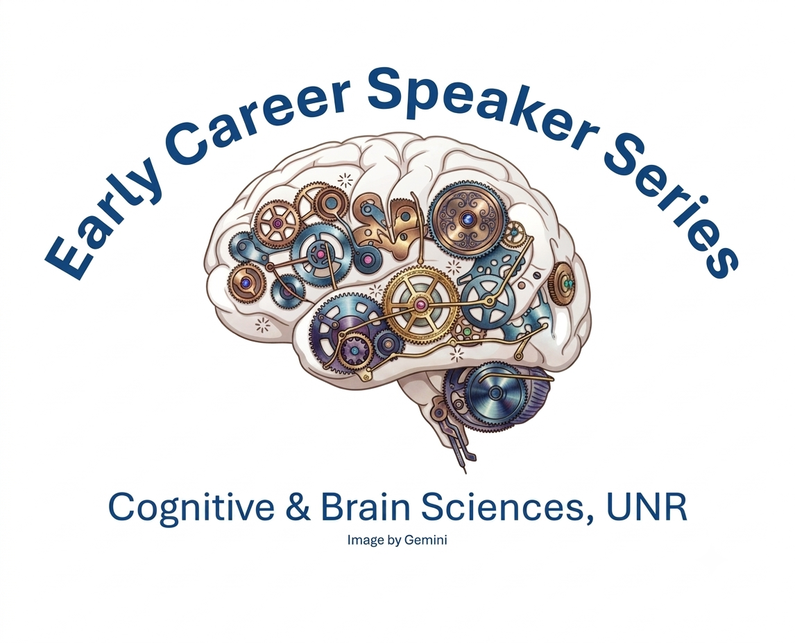

We host an Early Career Speaker series for the Psychology and Neuroscience group here at the University of Nevada, Reno!

If you are a graduate student, post-doc, or pre-tenured assistant professor and have a project that you would like to present, please contact me to see if you can present. 

We run the seminar bi-weekly, typically on Zoom to save travel (and money). For you, we hope the benefit is to practice presenting to a new audience. For us, the aim is to expose our students to the wealth of exciting work being conducted across the world, and to provide new connections across Universities.

Please keep in mind that we are based in Reno on Pacific Time (+8 hours UTC).

To date, we have hosted:
<b>2026</b>
Dr. Trenton Wirth (Assistant Professor, Unniversity of Cincinnati)
Dr. Simon Whitton (Postdoctoral Data Scientist, Cleveland Clinic, OH)
Dr. Jingyi He (Postdoctoral Researcher at the University of California, Berkeley)

<b>2025</b>
Dr. Vassiki Chauhan (Postdoctoral Researcher at Barnard College, Columbia University)
Dr. Sindhu Reddy Kalathur (Assistant Professor at Boise State University)
Mandi Severson (PhD Graduate at the University of Texas)
Evi Hendrikx (Postdoctoral Researcher at the University of California, Berkeley)
Maggie Welte (Graduate Researcher at the University of Delaware)
Narges Doostani (Postdoctoral Researcher at the Freie University Berlin)
Sascha Meyen (Postdoctoral Researcher at the University of Tübingen)
Yi Yuan (Assistant Professor at the University of California, San Jose State)

<b>2024</b>
Dr. Max Teaford (Assistant Professor at the University of Tennessee at Chattanooga)
Ghazaleh Mahzouni (Graduate student at the University of California, Santa Cruz)
Dr. Sebastian Frank (Group leader at the University of Regensburg)
Dr. Federico Tucci (Postdoctoral Researcher at Sapienza University of Rome)
Sarah Marchand (Graduate student at the University of Toulouse)
Dr. Timothy Murphy (Postdoctoral Researcher at the University of Wisconsin, Madison)
Anupama Nair (Graduate student at the Unviersity of Delaware)
Dr. Guochun Yang (Postdoctoral Researcher at the Unviersity of Iowa)
Dr. Patrick Bissett (Senior Researcher at Stanford University)

<b>2023</b>
Dr. Dina Popovkina (Postdoctoral Research at the University of Washington)
Samantha Montoya (Graduate student at the University of Minnesota; now a Postdoctoral Research at the University of Pennsylvania)
Dr. Jesse Breedlove (Postdoctoral Researcher at the University of Minnesota)
Dr. Camilla Simoncelli (Postdoctoral Researcher at UNR; now Lecturer at the University of Pisa)
Zoha Ahmad (Graduate student at York University)
Melissa Schoenlein (Graduate student at the Univeristy of Wisconin)
Dr. Daniel Garside (Postdoctoral Researcher at NIH)
Dr. Nadira Yusif Rodriguez (Postdoctoral Researcher at Brown University)
Carlos Carrasco (Graduate student at the University of California, Davis; now Researcher at the University of California, San Francisco)

<b>2022</b>
Dr Yi Gao (Postdoctoral Researcher at Georgia Tech; now Assistant Professor at the University of Nebraska at Omaha)
Dr. Marshall Green (Postdoctoral Researcher at Georgia Tech)
Maggie McMullin (Graduate student at the University of Nevada, Las Vegas)
Dr. Hector Arciniega (Postdoctoral Researcher at Harvard University; now Assistant Professor at New York University)
Phivos Phylactou (Graduate student at Cyprus University of Technology; now Postdoctoral Researcher at UNR)
Dr. Micaela Chan (Postdoctoral Researcher at the University of Texas, Dallas)
Dr. Alon Hafri (Postdoctoral Researcher at Johns Hopkins University; now Assistant Professor at the University of Delaware)
Dr. Solena Mednicoff (Postdoctoral Researcher at the University of Las Vegas; now at the Misophonia Research Foundation)
Dr. Jorge Morales (Assistant Professor at Northeastern University)

<b>2021</b>
Dr. Canhuang Luo (Postdoctoral Researcher at UNR; now Assistant Professor at Shenzhen University)
Cristina Ceja (Graduate student at Northwestern University)
Vasha Dutell (Graduate student at the University of California, Berkeley; now Lecturer)
Dr. Jessica Hua (Postdoctoral Researcher at the VA at the University of California San Francisco)
Tianjiao Zhang (Graduate student at the University of California, Berkeley; now Postdoctoral Researcher)
Arnelle Etienne (Research Assistant at Carnegie Mellon University)
Dr. Gennadiy Gurariy (Postdoctoral Researcher at the University of Misconsin, Milwaukee; now Assistant Professor at Ohio University)
Dr. Raymond Najjar (Assistant Professor, Duke-NUS Medical School; Singapore Eye Research Institute)
Dr. Alexandra Morrison and Dr. Lauren Richmond (Assistant Professors at Sacramento State and Stony Brook)
Dr. Kirsten Adam (Postdoctoral Researcher at the University of California San Diego; now Assistant Professor at Rice University)
Dr. Windy McNerney (Clinical Assistant Professor at Stanford University)
Cody Cushing (Graduate student at the Univeristy of California Los Angeles; now Postdoctoral Fellow)

<b>2020</b>
Dr. Shui'er Han (Postdoctoral Researcher at the University of Rochester)
Allison Allen (Graduate student at the University of California Santa Cruz)
Dr. Rebecca Keogh (Postdoctoral Researcher at the University of South Wales; now at Macquarie University)
Dr. Katie Tregillus (Postdoctoral Researcher at the University of Minnesota; now at Snap)
Dr. Marge Maallo (Postdoctoral Researcher at Carnegie Mellon University)
Dr. Selene Schintu (Postdoctoral Researcher at NIH and George Washington University; now Assistant Professor at the University of Trento)
Dr. Olena Kleshchova (Postdoctoral Researcher at UNR)
Dr. Tina Liu (Postdoctoral Researcher at NIH; now Assistant Professor at Georgetown University)

