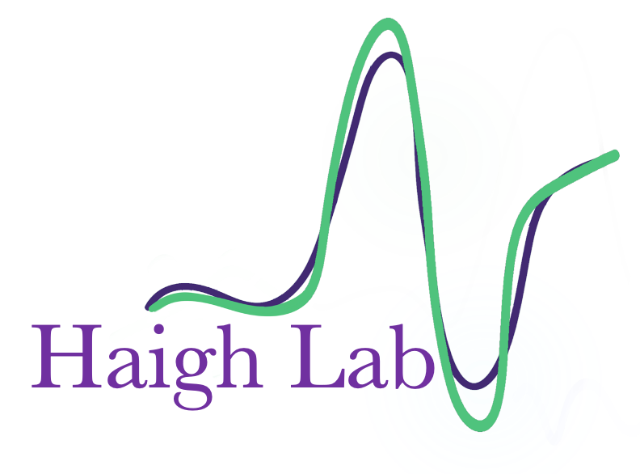

Do you find yourself feeling over-whelmed in noisy or busy environments? Find certain images or sounds repulsive or painful to look at? Or miss important information, even when you are focusing really hard? Have you noticed these behaviors happening more frequently since an event or trauma?

<button class="button" style="float: right">
 

 <b>A Quick Note</b>

 

 I am currently recruiting graduate  
 students for Fall 2026. Please contact  
 me for details.   
 If you are an undergraduate at UNR  
 and are interested in getting course  
 credit (PSY 275/375) or volunteering  
 in the lab, please contact me.  
 If you are a graduate student, 
 post-doc, or assistant professor and  
 are interested in presenting at our  
 Early Career Speaker series, please  
 click on the 'ECS' tab above' for more 
 information! 
</button>

These are the issues we focus on in the lab. We investigate how early sensory processing affects the ability to process information, and how individual differences in sensory sensitivity affect the sensory pathways. We primarily assess the mechanisms underlying sensory sensitivity using neuroimaging, electrophysiological, and behavioral methods. 

Many clinical conditions are associated with sensory complaints and so we are exploring the extent to which these complaints exacerbate symptoms, in individuals such as those with schizophrenia, autism, mTBI, visual stress, or migraine. Our approach is to view sensory sensitivity as a spectrum, with those who are on the extremes of the spectrum potentially requiring intervention to help daily functioning.

The hope is to find a treatment for these symptoms, and while there are some promising options being developed, there is still much to be done.

If you are interested in taking part in one of our studies, or experience unique sensory symptoms, please contact us.

 

News!
======
We always want to celebrate the accomplishments of the students in the lab, so here are some of the amazing things they have been up to:

<b>Graduation 2025</b> - Congratulations to Kensal Coudriet, Yasmin Perry on graduating! Thank you for your hard work and good luck!

<b>May 2025</b> - Sid Hulsey, Alayna McGuire, Kensal Coudriet, & Marcos Moreno Cervantes presented their work at the [WolfPack Discoveries](https://www.unr.edu/wolfpackdiscoveries) poster session.

 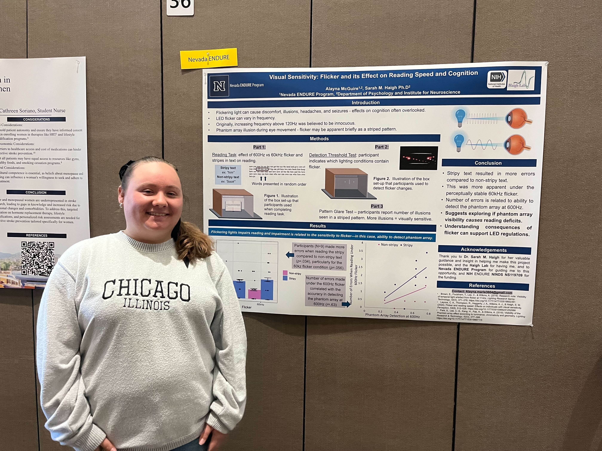 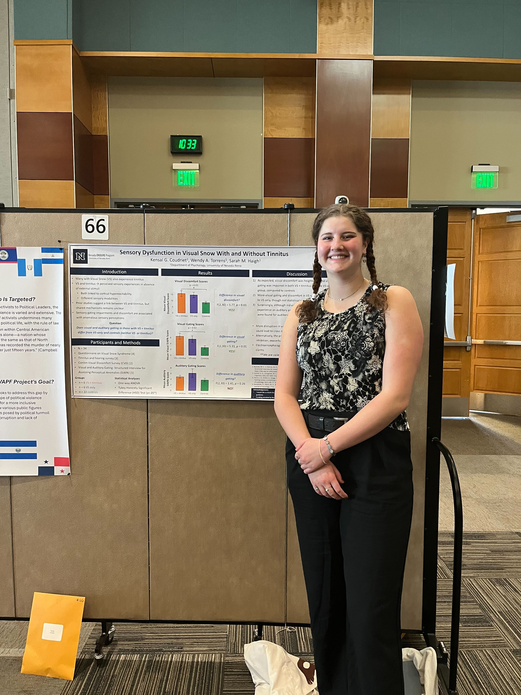 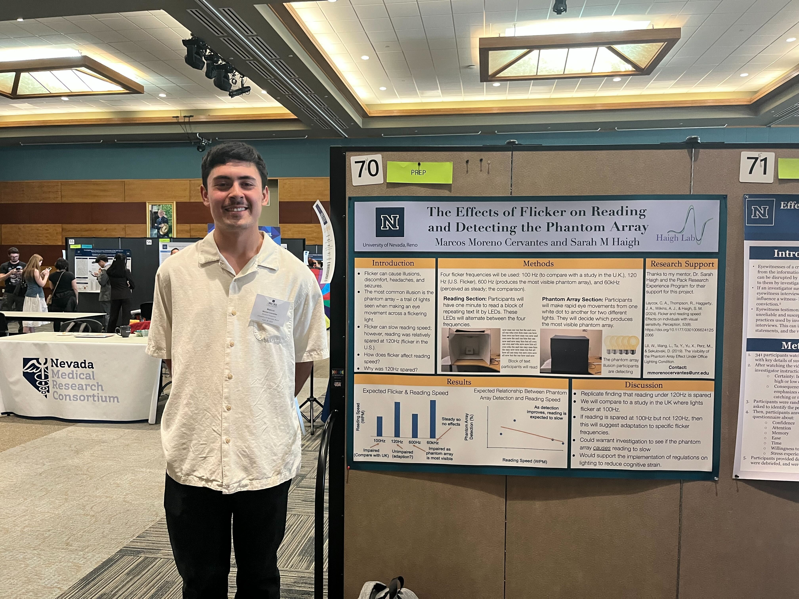 

<b>February 2025</b> - New paper using classification analysis to separate subclinical autism from schizotypy (nice work Jenna!) [here](https://doi.org/10.1080/13546805.2025.2464728).

<b>February 2025</b> - Wendy Torrens' trip to Cold Springs Harbor Laboratory was covered in this month's [Nevada Today](https://www.unr.edu/nevada-today/news/2025/cold-springs-harbor-lab-summer-courses)

<b>January 2025</b> - Welcome to Spring 2025! We have Marcos Moreno Cervantes (through the PREP program), Cheyenne McCormick, and Ruby Snyder joining the lab.

<b>December 2024</b> - Sid Hulsey, Alayna McGuire, and Kensal Coudriet presented their work at the [WolfPack Discoveries](https://www.unr.edu/wolfpackdiscoveries) poster session.

 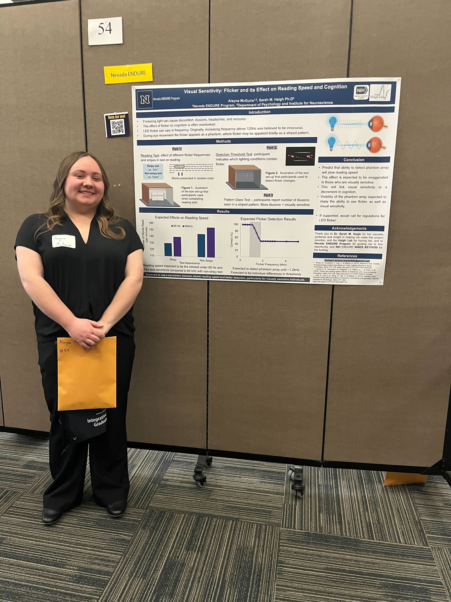 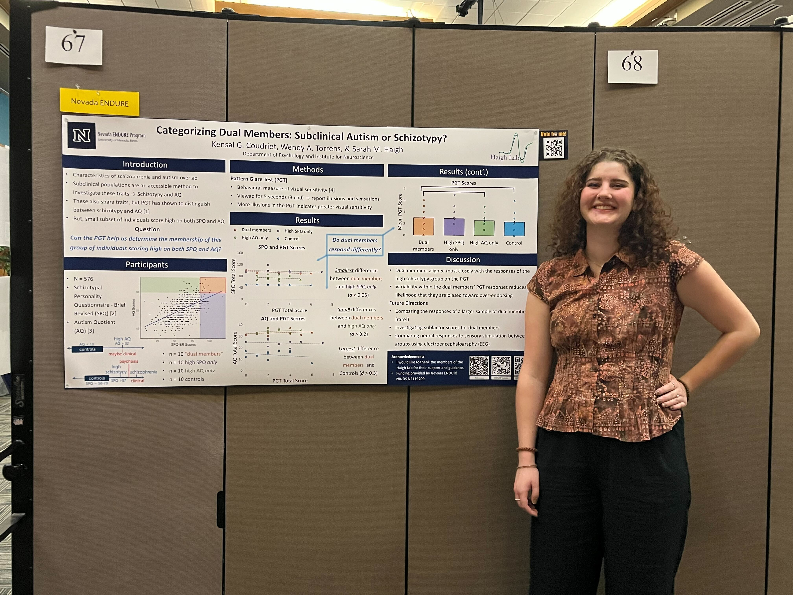  

<b>November 20204</b> - New paper on research priorities in the field of ASMR (Autonomous Sensory Meridian Response) [here](https://doi.org/10.1163/22134808-bja10136).

<b>September 2024</b> - Some news from lab alum, Jasmine Haggerty. She has started medical school at the University of Cincinnati and has just had her induction ceremony - congratulations! We love hearing about how our alumni are doing, so please keep in touch.

<b>August 2024</b> - Welcome to the new semester! We have Kensal Coudriet, Alayna McGuire, Sidney Hulsey, Yasmin Perry, Neville Roy, Mia Price, and Angelina Solorzano-Zamora joining the lab this semester.

<b>August 2024</b> - For those who have been requesting a version of Wendy's Pattern Glare Test image, she has kindly created a new version [here](https://doi.org/10.6084/m9.figshare.26852950.v1). Please remember to cite appropriately.

<b>June 2024</b> - Carson and Wendy helped and attended the International Multisensory Research Forum ([IMRF](https://imrf2024.sciencesconf.org/?lang=en)) in Reno. Hope you all enjoyed our beautiful city!

<b>June 2024</b> - Wendy Torrens attended (and thoroughly enjoyed) attending the Cold Springs Harbor Laboratory course on Schizophrenia & Related Disorders, [summer 2024](https://meetings.cshl.edu/courses.aspx?course=c-schiz&year=24).

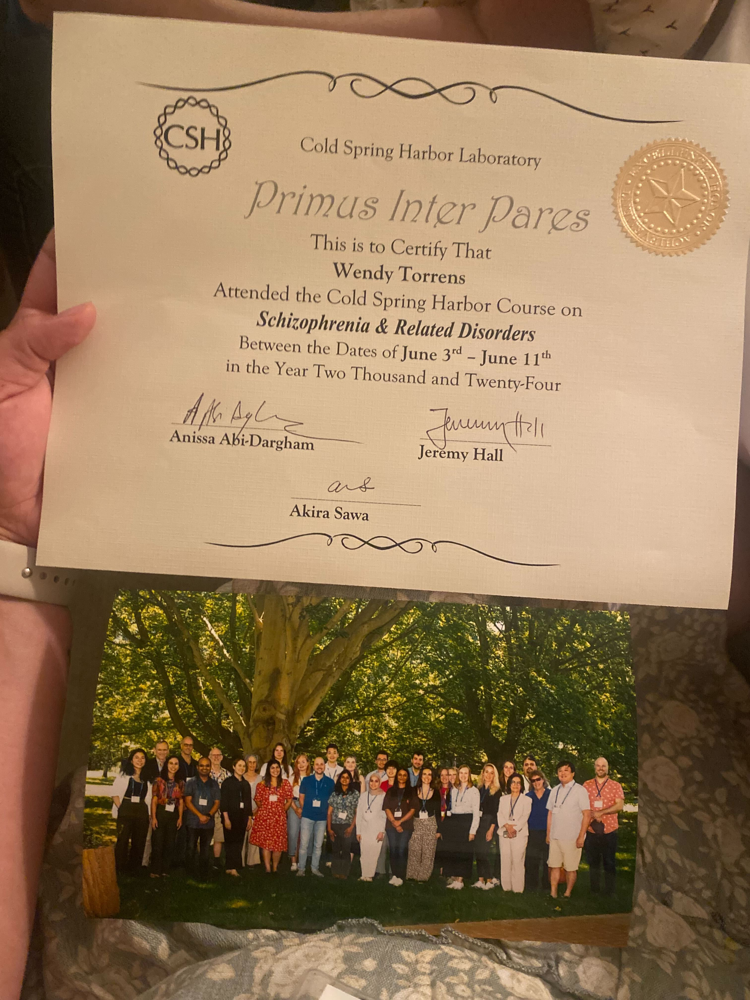

<b>May 2024</b> - Wendy and Michelle attended this year's Society of Biological Psychiatry ([SOBP](https://sobp.org/2024-sobp-annual-meeting/)) conference in Autin, TX.

<b>Graduation 2024!</b> - A huge congratulation to Michelle Ruiz, Rasia Yankaway, Shane Trivitt, and Lindsey Bevilacqua for graduating. Good luck with the next chapter.

<b>May 2024</b> - Carson Smith successfully defended his Master's on "Localizing Visual Allodynia in Migraine". Watch out for the paper to be submitted soon...

<b>May 2024</b> - Both Wendy and Carson presented their work at the Institute for Neuroscience's annual retreat. Wendy was joined by her RAs: Rasia and Michelle.

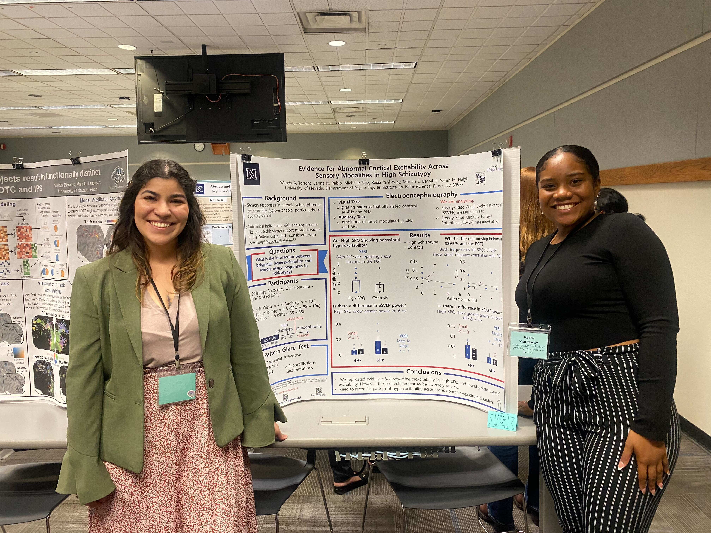
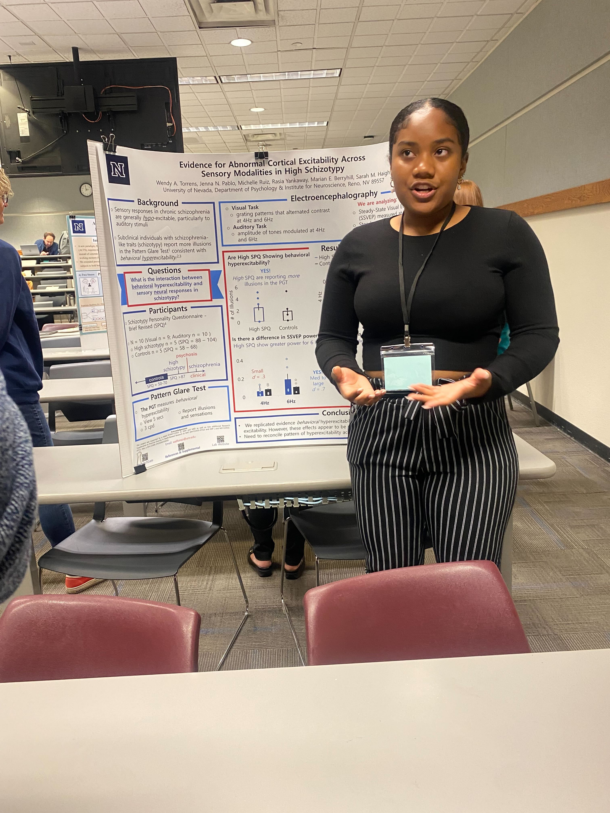
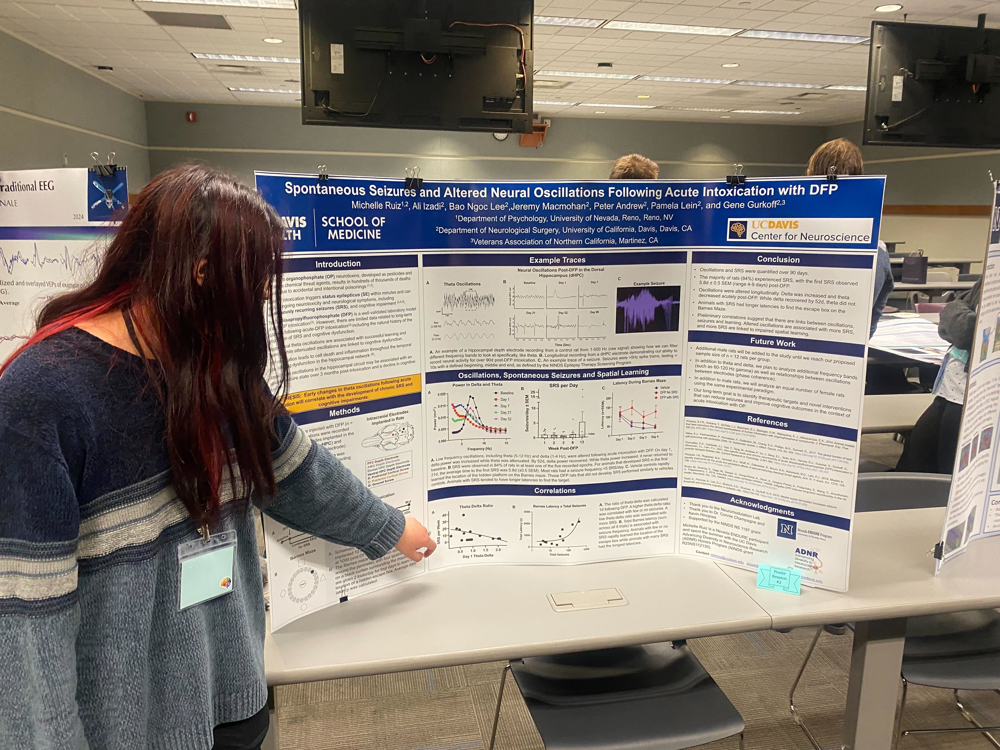

<b>May 2024</b> -  Michelle Ruiz and Izzy Durda both presented their work at the [WolfPack Discoveries](https://www.unr.edu/wolfpackdiscoveries) poster session. This is Michelle's sixth and final presentation with us - she's been amazing.

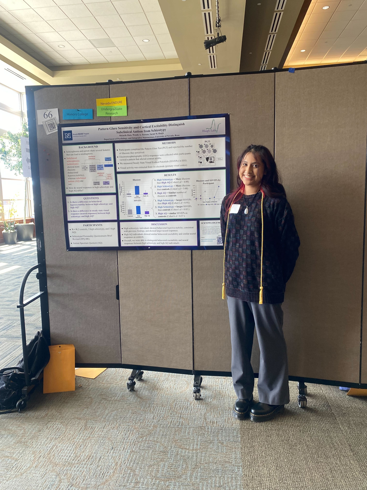
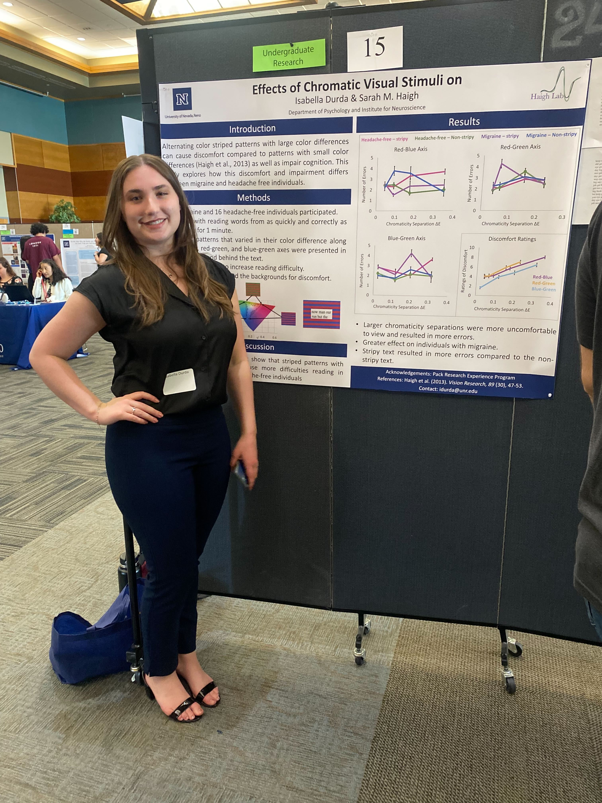

<b>May 2024</b> - We have published a paper on the effects of flickering light on reading. This wouldn't have been possible without the work of Caitlin Laycox, Rory Thompson, and Jasmine Haggerty - thank you. Access the paper [here](https://doi.org/10.1177/03010066241252066) for more information.

<b>March 2024</b> - Wendy Torrens was accepted to attend the Cold Springs Harbor Laboratory course on Schizophrenia & Related Disorders, [summer 2024](https://meetings.cshl.edu/courses.aspx?course=c-schiz&year=24)! She was also awarded a scholarship from the International Brain Research Organization to support her attendance - exciting!

<b>March 2024</b> - Wendy Torrens has just had another paper published! She assessed the use of the Pattern Glare Test on distinguishing between autistic and schitoypy traits in the general population. Access it early [here](https://www.tandfonline.com/eprint/YJVAMPU4GUBRKBYJ3AMI/full?target=10.1080/13546805.2024.2335103).

<b>Jan 2024</b> - Welcome Lindsey, Kate, Hailey, and Jackie to the lab! Hope you enjoy the research experience and gain some useful skills.

<b>Jan 2024</b> - We bid a fond farewell to Jasmine Haggerty who has completed some wonderful work in the lab over the past couple of years. Good luck with medical school! And stay tuned for papers that are under review.

<b>Dec 2023</b> - Congratulations to Izzy Durda who was awarded a Nevada Undergraduate Research Award (NURA)! Izzy comes from the [PREP program](https://www.unr.edu/undergradresearch/opportunities/prep) and has been working in the lab for a year already.

<b>Dec 2023</b> - Izzy Durda and Michelle Ruiz both presented their work at the [WolfPack Discoveries](https://www.unr.edu/wolfpackdiscoveries) poster session. Lovely data!

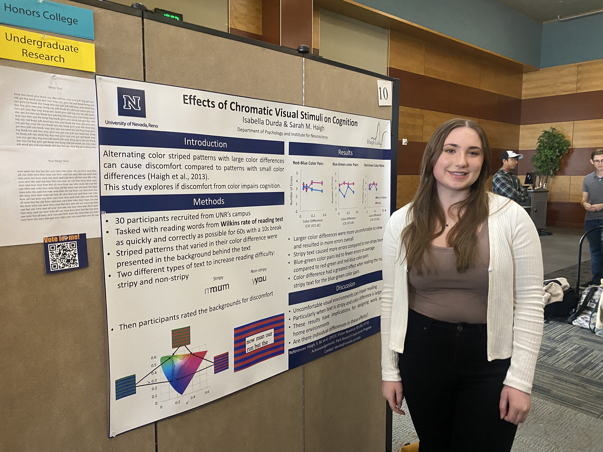
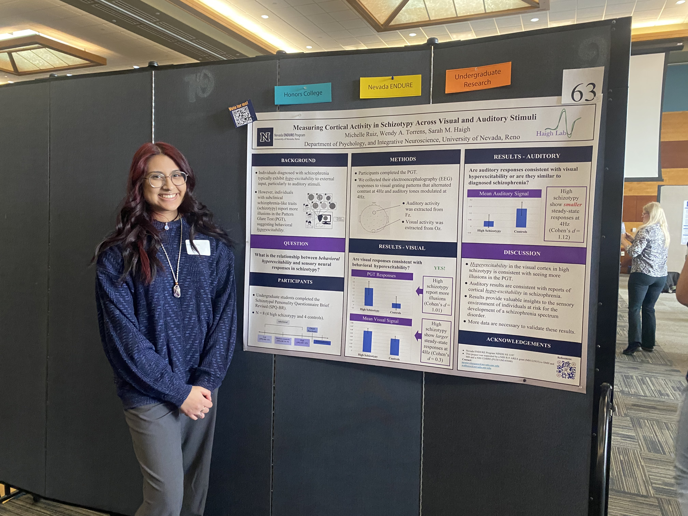

<b>Dec 2023</b> - Congratulations to Wendy Torrens who has won a travel award from SOBP! She will be presenting a poster on abnormal cortical excitability across sensory modalities in high schizotypy in May in Austin, TX.

<b>Nov 2023</b> - Wendy Torrens is presenting her poster at the Society for Neuroscience conference in Washington DC. Drop by to hear about her work developing a new EEG hair clip that works in all hair types!

<b>Oct 2023</b> - Congratulations to Carson Smith who won the Psychology Department's Wilson Award!

<b>Oct 2023</b> - We have a new publication on auditory discomfort. Check it out online [here](https://doi.org/10.3389/fpsyg.2023.1126481). This paper would not have been possible without the hard work of undergraduate RAs Anna Haugland, Lulu Mendoza, and Mackenzie Montero.

<b>Aug 2023</b> - Welcome to Geo, Amber, and Kiara to the lab! Let's collect some data!

<b>Aug 2023</b> - Congratulations to Wendy Torrens who was awarded a Trainee Development Program Award from the Society for Neuroscience! She will be presenting a poster on her recent data using hair clips to collect high quality EEG data regardless of hair type (patent pending).

<b>July 2023</b> - We have a new publication modelling the neural processes underlying visual discomfort. Check it out [here](https://doi.org/10.3389/fnins.2023.1200661).

<b>May 2023</b> - Carson Smith is presenting a poster on his study assessing visual functioning in migraine compared to headache-free individuals using ERG and EEG at the Vision Science Soiety conference in St Pete Beach, FL. 

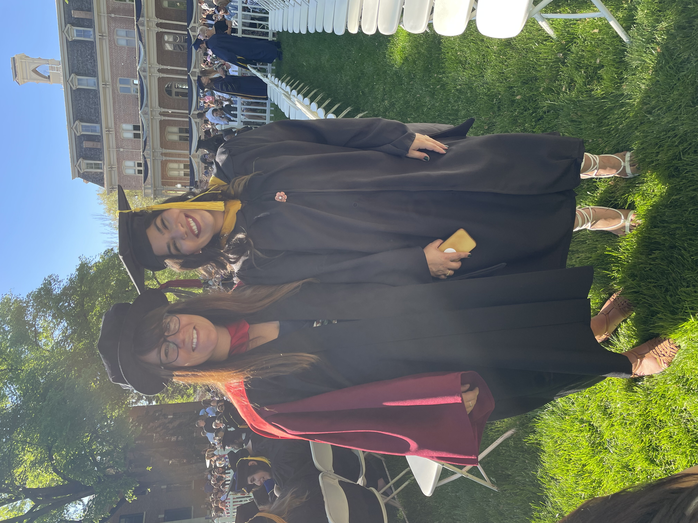
<b>May 2023</b> - Carson has also kindly volunteered to present my poster on the effects of flicker on reading at VSS this year, while I have my baby :)

<b>Graduation 2023!</b> - The best part about being a mentor... going to graduation! Wendy Torrens was granted her MS in Neuroscience! And now onto the PhD... 
Congratulations to our recent graduates: Matthew Cummings, Laura Van Key, and Savanna Blanchette. Good luck with the next chapter!

<b>May 2023</b> - Congratulations to Wendy Torrens who was one of several graduate students in the department to be awarded a Solso Award for Outstanding Scientific Achievement.

<b>May 2023</b> - Michelle Ruiz, Lilly Martin, and Izzy Durda all presented their work at the [WolfPack Discoveries](https://www.unr.edu/wolfpackdiscoveries) poster session. Excellent work!

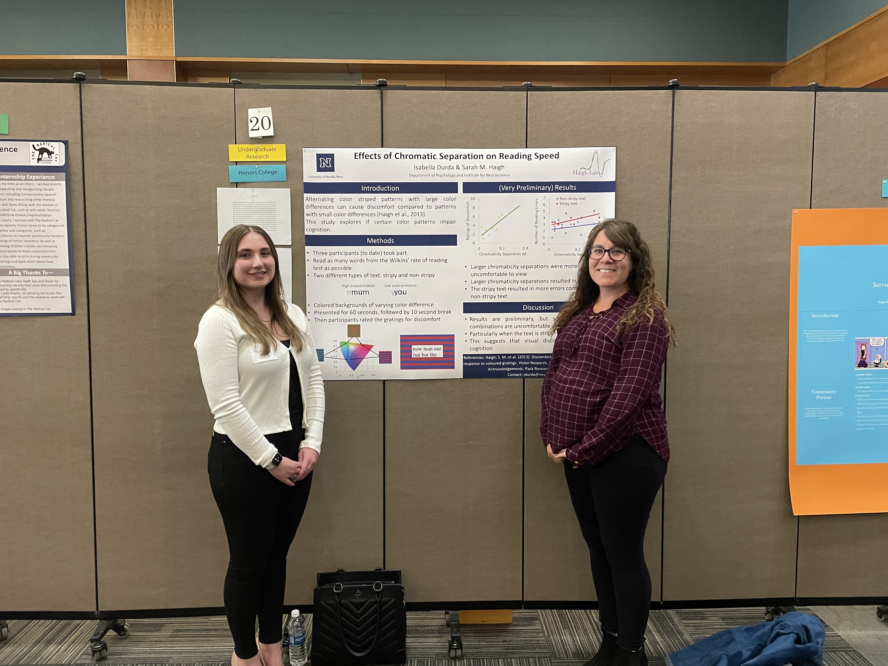
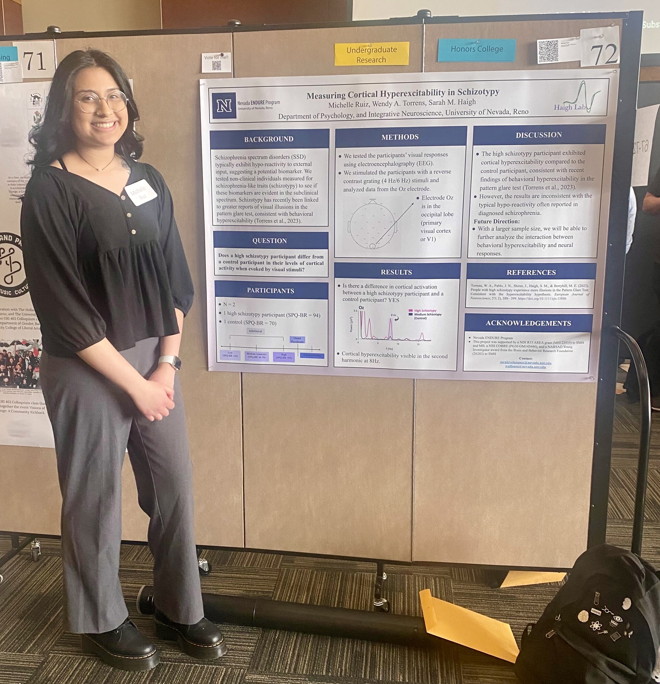
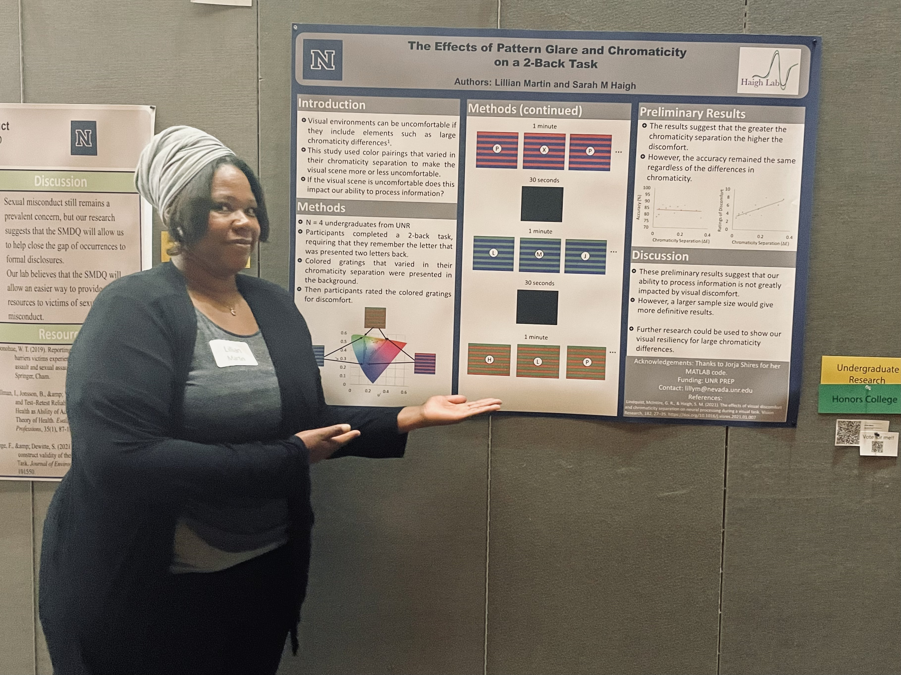
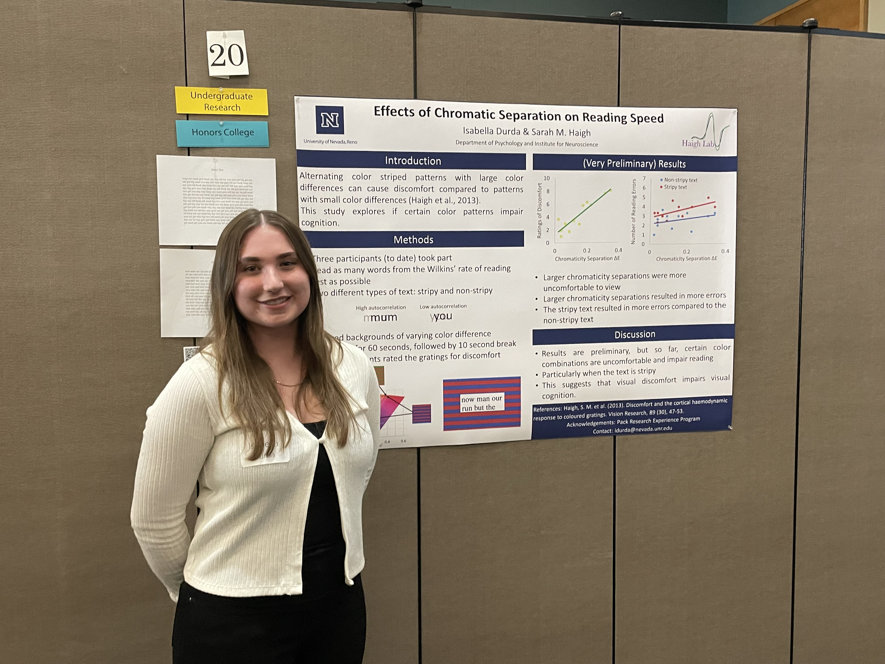

<b>March 2023</b> - A HUGE congratulations to Wendy Torrens for being awarded a GRFP from the NSF to examine (and design) hair clips for EEG to make electroencepahlography accessible for ALL hair types!!! This work is already preregistered [here](https://doi.org/10.17605/OSF.IO/AXU2C) and will be updated with tools and information as the project progresses.

<b>March 2023</b> - We have a new publication on sensory and working memory in schizotypy. Check it out [here](https://doi.org/10.1111/ejn.15961).

<b>Feb 2023</b> - Congratulations to Carson Smith who was awarded a travel award to attend this year's Vision Science Society conference in May! He will be presenting a poster on his recent work on visual responsiveness in migraine, assessed using electroretinography and electroencephalography.

