

Principal Investigator
======
<h2>Sarah Haigh</h2>
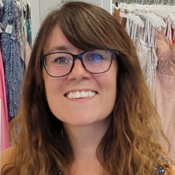

 <ul>
<li> BS (hons) Psychology - University of Bristol, UK (2009)</li>
<li> PhD Vision Science - University of Essex, UK (2012)</li>
<li> Post-doctoral Researcher - Carnegie Mellon University (2013)</li>
<li> Post-doctoral Associate - University of Pittsburgh School of Medicine (2014)</li>
<li> Research Scientist - Carnegie Mellon University (2017)</li>
<li> Assistant Professor - University of Nevada, Reno (2018)</li>
<li> Associate Professor - University of Nevada, Reno (2024)</li>
</ul>

Graduate Students
======
<h2>Wendy Alfonso Torrens</h2>
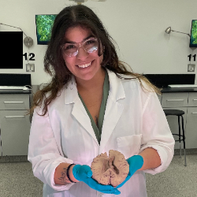

 <ul>
<li> BA Psychology with a minor in Spanish - Colorado State University-Pueblo</li>
<li> MS Neuroscience - University of Nevada, Reno</li>
<li> Currently a PhD student in Neuroscience at the University of Nevada, Reno</li>
</ul>

 My research focuses on contributing to the understanding of the neurobiological mechanisms underlying the sensory experience of individuals with schizophrenia and autism. I also strive to improve neurophysiological methods (e.g., electroencephalography) by developing more racially inclusive materials.

<b>Publications </b>

<ul>
<li>Jenna N Pablo, Jorja Shires, Wendy A Torrens, Lena L Kemmelmeier, Sarah M Haigh, & Marian E Berryhill (accepted). Identifying Overlapping and Distinctive Traits in Subclinical Autism and Schizophrenia Using Machine Learning Classification. <i>Cognitive Neuropsychiatry</i>. <a href="https://doi.org/10.1080/13546805.2025.2464728">https://doi.org/10.1080/13546805.2025.2464728</a></li> Early access link <a href="here">https://www.tandfonline.com/eprint/AMVF9BPFTMGY866TXTQH/full?target=10.1080/13546805.2025.2464728</a></li>
<li>Wendy Torrens (2024). Pattern Glare Sensitivity: Illusions and Sensations. <i>figshare.</i> Figure. <a href="https://doi.org/10.6084/m9.figshare.26852950.v1">https://doi.org/10.6084/m9.figshare.26852950.v1</a>.</li>
<li>Wendy A Torrens, Jenna N Pablo, Marian E Berryhill, & Sarah M Haigh (2024). Pattern glare sensitivity distinguishes subclinical autism and schizotypy. <i>Cognitive Neuropsychiatry. 29</i>(3), 155-175. <a href="https://doi.org/10.1080/13546805.2024.2335103">https://doi.org/10.1080/13546805.2024.2335103</a>.</li>
<li>Wendy A Torrens†, Jenna N Pablo†, Jorja Shires, Sarah M Haigh & Marian E Berryhill (2022). People with High Schizotypy Experience More Illusions in the Pattern Glare Test: Consistent with the Hyperexcitability Hypothesis († co-first authors). <i>European Journal of Neuroscience,</i> 1-12. <a href="https://doi.org/10.1111/ejn.15886">https://doi.org/10.1111/ejn.15886</a>.</li> 
</ul>

<b>Conference Presentations </b>

<ul>
<li>Wendy A Torrens, Jenna N Pablo, Michelle Ruiz, Rasia Yankaway, Marian E Berryhill & Sarah M Haigh (June 2024). Anomalous multisensory cortical excitability in Schizotypy. Poster presented at the International Multisensory Research Forum, Reno, NV, USA.</li>
<li>Wendy A Torrens, Jenna N Pablo, Michelle Ruiz, Rasia Yankaway, Marian E. Berryhill, & Sarah M. Haigh (May 2024). Evidence for abnormal cortical excitability across sensory modalities in high schizotypy. Poster presented at the Society of Biological Psychiatry conference, Austin, TX, USA. SOBP travel award to Wendy Alfonso.</li>
<li>Lena L Kemmelmeier, Jenna N Pablo, Jorja Shires, Hector Arciniega, Wendy A Torrens, Sarah M Haigh, Marian E Berryhill (April 2024). Reduced mismatch negativity in college students with a history of mTBI. Presentation at the Cognitive Neurosciences Society conference, Toronto, ON, Canada.</li>
<li>Jenna N Pablo, Wendy A Torrens, Jorja Shires, Sarah M Haigh, & Marian E Berryhill (April 2024). Working memory deficit in high schizotypy: ERP but no power differences. Presentation at the Cognitive Neurosciences Society conference, Toronto, ON, Canada.</li>
<li>Wendy A Torrens, Rasia Yankaway, Michelle Ruiz, Sarah M Haigh (November 2023). The effect of hair type on Electroencephalography: Testing a new clip. Poster presented at the Society for Neuroscience conference, Washington DC, USA. TPDA award to Wendy Torrens.</li>
<li>Wendy A. Torrens, Jenna N. Pablo, Jorja Shires, Marian E. Berryhill & Sarah M. Haigh (April 2023). Auditory deviance detection in Schizotypy. Poster presented at the Society of Biological Psychiatry conference. San Diego, CA, USA. <i>Biological Psychiatry 93</i>(9), S227. <a href="https://doi.org/10.1016/j.biopsych.2023.02.570">https://doi.org/10.1016/j.biopsych.2023.02.570</a>.</li>
<li>Jenna N. Pablo, Wendy A. Torrens, Jorja Shires, Sarah M. Haigh, & Marian E. Berryhill (April 2023). Pursuit of a reliable working memory biomarker characterizing the high-schizotypy population. Poster presented at the Society of Biological Psychiatry conference. San Diego, CA, USA. <i>Biological Psychiatry 93</i>(9), S187. <a href="https://doi.org/10.1016/j.biopsych.2023.02.472">https://doi.org/10.1016/j.biopsych.2023.02.472</a>. </li>
<li>Jorja Shires, Jenna N. Pablo, Wendy A. Torrens, Lena L. Kemmelmeier, Sarah M. Haigh, Marian E. Berryhill (April 2023). Classifying Schizotypy Trait Load Using Autism-Spectrum Quotient Scores. Poster presented at the Society of Biological Psychiatry conference. San Diego, CA, USA.</li>
<li>Marian E. Berryhill, Jenna N. Pablo, Jorja Shires, Wendy A. Torrens & Sarah M. Haigh (March 2023). High Schizotypy Participants Exhibit A Reduced Working Memory Induced P300. Poster presented at the Cognitive Neurosciences Society conference. San Francisco, CA, USA.</li>
<li>Wendy Alfonso Torrens, Jenna N Pablo, Marian E Berryhill & Sarah M Haigh (Nov 2022). Behavioral measures of cortical hyper-excitability in subclinical autism (ASD) and schizotypy. Poster presented at the Society for Neuroscience conference. San Diego, CA, USA.</li>
</ul>

<h2>Carson Smith</h2>
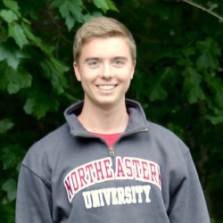

 <ul>
<li> BS Psychology and Neuroscience - Northeastern University, MA</li>
<li> Currently a PhD student in Neuroscience at the University of Nevada, Reno</li>
</ul>

 My research interests include exploring the mechanisms behind our sensory systems that permit complex perception of the world around us. By examining the limits of our visual and auditory systems, we can begin to paint a clearer picture of how various stimuli shape our environmental perception.

Specifically, my current project investigates how sensory sensitivity changes over the migraine cycle with the aim to identify biomarkers that signal approaching migraine-onset. While there is a lot of variability across migraineurs, a common symptom is sensitivity to light (photophobia) and/or sound (phonophobia). Using electroencephalography (EEG), electroretinography (ERG), and auditory brainstem response (ABR), my research contrasts the effects of sensory stimuli on migraineurs and headache free individuals from the retina and brainstem to the visual and auditory cortices. 

<b>Conference Presentations </b>

<ul>
<li>Carson C Smith, Shane Trivitt, Matthew Cummings, Amber Thaxton & Sarah M Haigh (June 2024). Localizing Visual Allodynia in Migraine. Poster presented at the International Multisensory Research Forum, Reno, NV, USA.</li>
<li>Carson C Smith, Matthew Cummings, Laura I Van Key & Sarah M Haigh (May 2023). Localizing Visual Allodynia in Migraine. Poster presented at the Vision Sciences Society, St Petersburg, FL, USA. <i>Journal of Vision 23</i>(9), 5474. <a href="https://doi.org/10.1167/jov.23.9.5474">https://doi.org/10.1167/jov.23.9.5474</a>. VSS travel award to Carson Smith.</li>
</ul>

Undergraduate and Volunteer Research Assistants
======

<h2>Marcos Moreno Cervantes</h2>
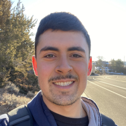

Hey, my name is Marcos Moreno Cervantes. I am a Freshman at the University of Nevada, Reno, majoring in neuroscience. I love learning about the mind and finding ways to use that information to optimize my life. Along with this, I enjoy weightlifting, cinematography, and mixing music during my free time. I have no background in research but recently got accepted into PREP with Dr. Haigh as my mentor. I aspire to become a psychiatrist, where I will gain a better understanding of the mind and body to not only help those with psychiatric disorders but also neurotypical individuals.

 

<h2>Cheyenne McCormick</h2>
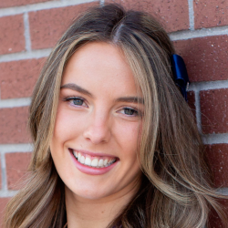

Hello! My name is Cheyenne McCormick and I am a junior pursuing a B.S. in Psychology, minoring in sociology. In my free time I enjoy traveling and baking. I am also a cheerleader for the University. I am hoping to have a career in clinical psychology one day. I do not have much prior experience with experimental psychology, but I am eager to learn and grow within this lab. In my time with Professor Haigh and Wendy Alfonso, I hope to expand my knowledge on experimentation; Specifically how to collect and interpret data.

 

<h2>Ruby Snyder</h2>
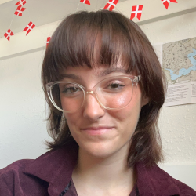

Hello! I’m Ruby and I am a senior majoring in Psychology with a minor in Art. I hope to one day become a practicing clinical psychologist working with clients who have suffered from traumatic events. While the clinical side of psychology is my ultimate passion, I love the community environment of academic research and getting to help others through the pursuit of knowledge. I am particularly excited to work in the Haigh lab due to their work on sensory sensitivity and the limitations of our senses.

 

<h2>Neville Roy</h2>

 I am a sophomore studying Neuroscience at UNR. I have always been fascinated with the brain and I'm glad Dr.Haigh gave me this opportunity. My research interests are everything Migraine because I have so many friends and family that have the condition. After graduating, I plan to join an MD program and become a psychiatrist.

 

<h2>Mia Price</h2>
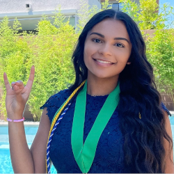

 Hey! I am a junior pursuing a B.S. in Psychology, minoring in Black Studies and Social Justice. Although I do not have very much neuroscience experience through this lab I'm hoping to get more exposure to everything neuroscience! I have not yet decided if I want to go down a clinical or research career path however, I am sure I want to help communities of color and more specifically the Black community with whatever work I do. 

 

<h2>Alayna McGuire</h2>
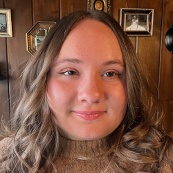

 Hello! My name is Alayna McGuire and I am a Junior pursuing a Neuroscience B.S. I love to travel, cook/bake, and try new things, and despite my broad interest in the Neuroscience field, I have a particular regard for cognitive neuroscience. As for my research interests, I want to study more on sensory processing, specifically deficits for people with neurological disorders. I have found a passion in studying neuroscience through the research I have done in the past, and what I am doing now. My goal is to explore and learn what I can through my research, and potentially pursue an MD/PhD program or a PhD in Neuroscience working at a company's research lab. I hope to make a valuable contribution to the Neuroscience community, and help people with these issues through my discoveries. 

 

<h2>Sidney Hulsey</h2>
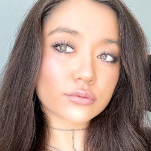

 Hi! I am a junior at the University of Nevada, Reno studying Neuroscience with a minor/certificate in Gerontology. Previously, I worked in Dr. Piantadosi’s Computation and Language Lab for a summer studying psychophysical modeling techniques for approximate number tasks. My research interests are in sensory processing and neurodevelopmental disorders. I love working with students on campus with IDDs and other disabilities with the P2I and TAPDINTO-STEM programs. After graduating, I plan to apply to an M.D.-Ph.D. program where I can further pursue my interests. 

 

<h2>Kate Pellegrino</h2>
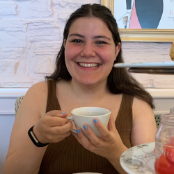

 I am a sophomore at the University of Nevada, Reno studying Neuroscience. I am excited to learn about different laboratory techniques that can help us have a better understanding of the brain like EEG, ERG, and ABR. Additionally interested in how a lab runs and works as a whole.

   

<h2>Isabella Durda</h2>
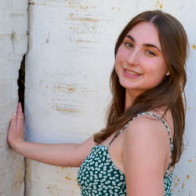

 I am currently a junior at UNR majoring in Psychology and doing a minor/certificate program in gerontology. While I’ve helped in a lab before coming to UNR, working with Dr. Haigh is the first official lab experience I have had. I am excited to have the opportunity to learn new things and grow throughout this journey. As of right now, I want to become an occupational therapist specializing in pediatrics because I am passionate about helping people live their lives to the fullest and love working with kids!

 

Former Graduate Students
======
<h2>Stephanie Otto</h2>
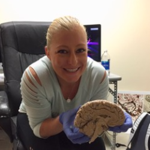

 <ul>
<li> BA Psychology - University of Hawaii, West Oahu (2015)</li>
<li> MS Cognitive Brain Science - University of Nevada, Reno (2020)</li>
<li> PhD Cognitive Brain Science - University of Nevada, Reno (2022)</li>
<li> Currently a post-doctoral researcher at the Naval Medical Research Unit, Dayton, OH</li>
</ul>

<b>Publications</b>

 Simon Whitton, Jung Min Kim, Alexandra N. Scurry, Stephanie Otto, Xiaowei Zhuang, Dietman Cordes, & Fang Jiang. (2021). Multisensory temporal processing in early deaf. <i>Neuropsychologia, 163,</i> 108069. <a href="https://doi.org/10.1016/j.neuropsychologia.2021.108069">https://doi.org/10.1016/j.neuropsychologia.2021.108069</a>.

<b>Conference Presentations </b>

<ul>
<li>Stephanie R Otto, Yueran Yang, Lawrence Ray, Jolie Travers, Jeffrey Hutsler & Sarah M Haigh (Nov 2022). Evidence of wide-spread white matter compromise in autism spectrum disorder: a large-scale diffusion imaging study using repository data. Poster presented at the Society for Neuroscience conference. San Diego, CA, USA.</li>
<li>Stephanie R Otto, Lawrence M Ray, Jolie A Travers, Isabella Bruketta, Mackenzie L Montero, Jeffrey J Hutsler & Sarah M Haigh (May 2020). Abnormal measures of white matter diffusion are associated with behavioral symptom severity in children and adults with autism. Poster online at the Society of Biological Psychiatry conference. New York, NY, USA. <i>Biological Psychiatry 87</i>(9), S246. <a href="https://doi.org/10.1016/j.biopsych.2020.02.636">https://doi.org/10.1016/j.biopsych.2020.02.636</a>.</li> 
<li>Stephanie R Otto, Lawrence M Ray, Jolie A Travers, Isabella Bruketta, Mackenzie L Montero, Jeffrey J. Hutsler & Sarah M Haigh (October 2019). Evidence of wide spread white matter compromise in children and adults with autism: a large-scale diffusion imaging study using the ABIDE II repository. Poster presented at the Society for Neuroscience. Chicago, IL, USA.</li>
</ul>

<h2>Marena Manierka</h2>
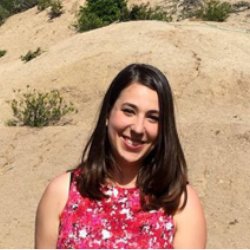

 <ul>
<li> BS (hons) Neuroscience & Psychology - University of Toronto, Canada (2013)</li>
<li> PhD Neuroscience - University of Nevada, Reno (2021)</li>
<li> Currently a medical writer for BOLDSCIENCE</li>
</ul>

<b>Publications</b>

 Marena S Manierka, Rachel Rezaei, Samantha Palacios, Sarah M Haigh, Jeffrey J Hutsler (2021). In the mood to be social: affective state influences facial emotion recognition in healthy adults. <i>Emotion.</i> <a href="https://doi.org/10.1037/emo0000999">https://doi.org/10.1037/emo0000999</a>.

<h2>Lisa Lindquist</h2>
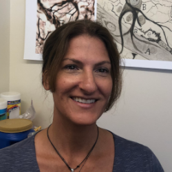

 <ul>
<li> BS Speech and Hearing Science - Western Washington University, Bellingham, WA</li>
<li> MS Speech-Language Pathology - Rush University, Chicago, IL</li>
</ul>

<b>Publications</b>

 Lisa C Lindquist, Gregory R McIntire & Sarah M Haigh (2021). The effects of visual discomfort and chromaticity separation on neural processing during a visual task. <i>Vision Research. 182,</i> 27-35. <a href="https://doi.org/10.1016/j.visres.2021.01.007">https://doi.org/10.1016/j.visres.2021.01.007</a>.

<b>Conference Presentations </b>

<ul>
<li>Lisa C Lindquist, Gregory R McIntire & Sarah M Haigh (May 2020). The effect of chromaticity separation on neural processing during a visual task. Poster presented at virtual Vision Sciences Society (vVSS). <i>Journal of Vision 20</i>(11), 828-828. <a href="https://doi.org/10.1167/jov.20.11.828">https://doi.org/10.1167/jov.20.11.828</a>. </li>
<li>Lisa Lindquist, Gregory R McIntire Jr & Sarah M Haigh (September 2019). The impact of chromaticity separation on information processing. Poster presented at the Bay Area Vision Research Day. Berkeley, CA, USA.</li> 
<li>Gregory R McIntire Jr, Lisa Lindquist & Sarah M Haigh (September 2019). The impact of uncomfortable visual stimuli on face processing. Poster presented at the Bay Area Vision Research Day. Berkeley, CA, USA.</li>
</ul>

<h2>Gregory McIntire</h2>

 <ul>
<li> BA Psychology & Biology - University of Nevada, Las Vegas (2018)</li>
<li> MS Neuroscience - University of Nevada, Reno</li>
</ul>

<b>Publications</b>

 Lisa C Lindquist, Gregory R McIntire & Sarah M Haigh (2021). The effects of visual discomfort and chromaticity separation on neural processing during a visual task. <i>Vision Research. 182,</i> 27-35. <a href="https://doi.org/10.1016/j.visres.2021.01.007">https://doi.org/10.1016/j.visres.2021.01.007</a>.

<b>Conference Presentations </b>

<ul>
<li>Lisa C Lindquist, Gregory R McIntire & Sarah M Haigh (May 2020). The effect of chromaticity separation on neural processing during a visual task. Poster presented at virtual Vision Sciences Society (vVSS). <i>Journal of Vision 20</i>(11), 828-828. <a href="https://doi.org/10.1167/jov.20.11.828">https://doi.org/10.1167/jov.20.11.828</a>. </li>
<li>Lisa Lindquist, Gregory R McIntire Jr & Sarah M Haigh (September 2019). The impact of chromaticity separation on information processing. Poster presented at the Bay Area Vision Research Day. Berkeley, CA, USA.</li> 
<li>Gregory R McIntire Jr, Lisa Lindquist & Sarah M Haigh (September 2019). The impact of uncomfortable visual stimuli on face processing. Poster presented at the Bay Area Vision Research Day. Berkeley, CA, USA.</li>
</ul>

Former Lab Managers
======

<h2>Caitlin Laycox</h2>
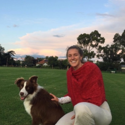

 <ul>
<li> BS Psychology - Griffith University Australia (2018)</li>
<li> Honour's from Southern Cross University (2019)</li>
<li> Currently a PhD student in Psychology at Southern Cross University (started 2020)</li>
</ul>

<b>Publications</b>

Caitlin A Laycox, Rory Thompson, Jasmine A Haggerty, Arnold J Wilkins & Sarah M Haigh (2024). Flicker Slows Reading Speed: Effects on Individuals with Visually Sensitivity. <i>Perception. 53</i>(8), 512-528. <a href="https://doi.org/10.1177/03010066241252066">https://doi.org/10.1177/03010066241252066</a>.
<b>Conference Presentations </b>

Sarah M Haigh, Caitlin A Laycox, Rory Thompson, Jasmine A Haggerty & Arnold J Wilkins (May 2023). Flicker Impairs Reading Speed: Impacts on the Visually Sensitive. Poster presented at the Vision Sciences Society, St Petersburg, FL, USA. <i>Journal of Vision 23</i>(9), 4782. <a href="https://doi.org/10.1167/jov.23.9.4782">https://doi.org/10.1167/jov.23.9.4782</a>.

<h2>Mackenzie Montero</h2>
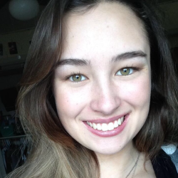

 <ul>
<li> BS-MD Neuroscience - University of Nevada, Reno (2021)</li>
<li> Currently a medical student at the University of Nevada, Reno</li>
</ul>

<b>Publications</b>

Sarah M Haigh, Anna M Haugland, Lourdes M Mendoza, & Mackenzie Montero (2023). Auditory discomfort in visually sensitive individuals. <i>Frontiers in Psychology: Perception Science. 14,</i> 1126481. <a href="https://doi.org/10.3389/fpsyg.2023.1126481">https://doi.org/10.3389/fpsyg.2023.1126481</a>.

<b>Conference Presentations</b>

Sarah M Haigh, Lourdes R Mendoza & Mackenzie Montero (Nov 2021). Auditory discomfort in migraine and the visually-sensitive. Poster presented at the virtual Society for Neuroscience conference. 
 

<h2>Alexandrea Kilgore-Gomez</h2>
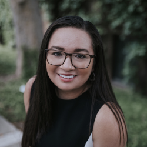

<ul>
<li> BS Neuroscience - University of Nevada, Reno (2020)</li>
<li> NIH IRTA postbaccalaureate in Dr. Sheerena Rahman's lab</li>
<li> Currently a medical student at the University of Nevada, Reno</li>
</ul>

<b>Publications</b>

Sarah M Haigh†, Marian E Berryhill†, Alexandrea Kilgore-Gomez, & Michael Dodd (2023). Working memory and sensory memory in schizotypy: an avenue for understanding schizophrenia? (†Joint first authors). <i>European Journal of Neuroscience, 57,</i> 1577-1596. <a href="https://doi.org/10.1111/ejn.15961">https://doi.org/10.1111/ejn.15961</a>.

 

Former Research Assistants
======

<h2>Kensal Coudriet</h2>
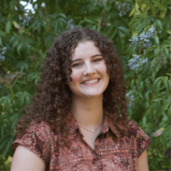

 BS Neuroscience - University of Nevada, Reno (2025)

 

<h2>Yasmin Perry</h2>
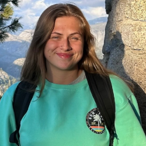

 BA Psychology - University of Nevada, Reno (2025)

 

<h2>Amber Thaxton</h2>
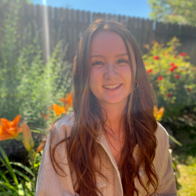

 BS Neuroscience - University of Nevada, Reno (2024)

 

<h2>Angelina Solorzano-Zamora</h2>
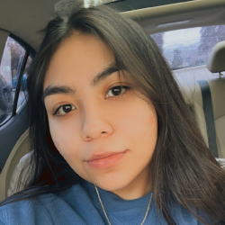

 BS Psychology - University of Nevada, Reno (2024)

 

<h2>Michelle Ruiz</h2>
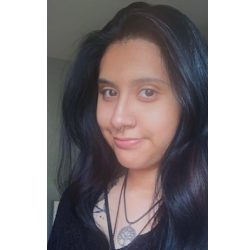

 BS Psychology - University of Nevada, Reno (2024)

<b>Conference Presentations </b>

<ul>
<li>Wendy A Torrens, Jenna N Pablo, Michelle Ruiz, Rasia Yankaway, Marian E Berryhill & Sarah M Haigh (June 2024). Anomalous multisensory cortical excitability in Schizotypy. Poster presented at the International Multisensory Research Forum, Reno, NV, USA.</li>
<li>Wendy A Torrens, Jenna N Pablo, Michelle Ruiz, Rasia Yankaway, Marian E. Berryhill, & Sarah M. Haigh (May 2024). Evidence for abnormal cortical excitability across sensory modalities in high schizotypy. Poster presented at the Society of Biological Psychiatry conference, Austin, TX, USA.</li>
<li>Wendy A Torrens, Rasia Yankaway, Michelle Ruiz, Sarah M Haigh (November 2023). The effect of hair type on Electroencephalography: Testing a new clip. Poster presented at the Society for Neuroscience conference, Washington DC, USA.</li>
</ul>

<h2>Hailey Snook</h2>
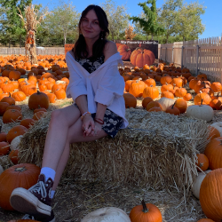

 BS Psychology - University of Nevada, Reno (2024)

 

<h2>Jackie Vallo</h2>
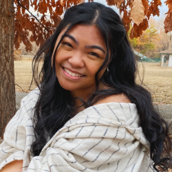

 BS Microbiology & Immunology - University of Nevada, Reno (2023)

 

<h2>Rasia Yankaway</h2>
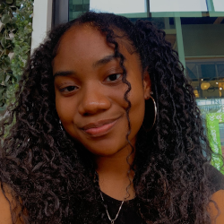

 BS Psychology - University of Nevada, Reno (2024)

<b>Conference Presentations </b>

<ul>
<li>Wendy A Torrens, Jenna N Pablo, Michelle Ruiz, Rasia Yankaway, Marian E Berryhill & Sarah M Haigh (June 2024). Anomalous multisensory cortical excitability in Schizotypy. Poster presented at the International Multisensory Research Forum, Reno, NV, USA.</li>
<li>Wendy A Torrens, Jenna N Pablo, Michelle Ruiz, Rasia Yankaway, Marian E. Berryhill, & Sarah M. Haigh (May 2024). Evidence for abnormal cortical excitability across sensory modalities in high schizotypy. Poster presented at the Society of Biological Psychiatry conference, Austin, TX, USA.</li>
<li>Wendy A Torrens, Rasia Yankaway, Michelle Ruiz, Sarah M Haigh (November 2023). The effect of hair type on Electroencephalography: Testing a new clip. Poster presented at the Society for Neuroscience conference, Washington DC, USA.</li>
</ul>

<h2>Shane Trivitt</h2>
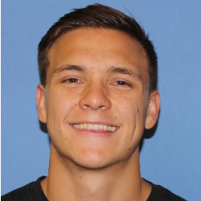

 BS Psychology - University of Nevada, Reno (2024)

<b>Conference Presentations </b>

<ul>
<li>Carson C Smith, Shane Trivitt, Matthew Cummings, Amber Thaxton & Sarah M Haigh (June 2024). Localizing Visual Allodynia in Migraine. Poster presented at the International Multisensory Research Forum, Reno, NV, USA.</li>
</ul>

<h2>Lindsey Bevilacqua</h2>
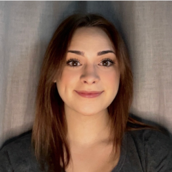

 BS Psychology - University of Nevada, Reno (2024)

 

<h2>Savanna Blanchette</h2>
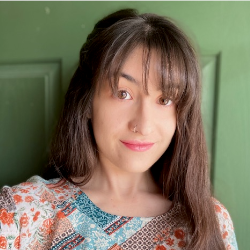

 BA Psychology - University of Nevada, Reno (2023)

 
<h2>Matthew Cummings</h2>
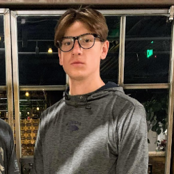

 BS Neuroscience - University of Nevada, Reno (2023)

<b>Conference Presentations </b>

Carson C Smith, Matthew Cummings, Laura I Van Key & Sarah M Haigh (May 2023). Localizing Visual Allodynia in Migraine. Poster presented at the Vision Sciences Society, St Petersburg, FL, USA. <i>Journal of Vision 23</i>(9), 5474. <a href="https://doi.org/10.1167/jov.23.9.5474">https://doi.org/10.1167/jov.23.9.5474</a>.

<h2>Mariah Meagher</h2>

BA Psychology - University of Nevada, Reno (2023)

 
<h2>Jasmine Haggerty</h2>
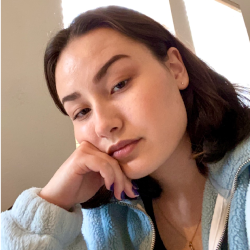

BS Psychology - University of Nevada, Reno (2022)

Currently a medical student at the University of Cincinnati College of Medicine in Cincinnati, Ohio (class 2028)

<b>Publications</b>

Sarah M Haigh, Jasmine A Haggerty & Aimee Delgado (2025). Auditory Discomfort and Visual Sensitivity. *Vision Research: Special Issue on Sensory Discomfort. 234*, 108655. <a href="https://doi.org/10.1016/j.visres.2025.108655">https://doi.org/10.1016/j.visres.2025.108655</a>.

Caitlin A Laycox, Rory Thompson, Jasmine A Haggerty, Arnold J Wilkins & Sarah M Haigh (2024). Flicker Slows Reading Speed: Effects on Individuals with Visually Sensitivity. <i>Perception. 53</i>(8), 512-528. <a href="https://doi.org/10.1177/03010066241252066">https://doi.org/10.1177/03010066241252066</a>.
<b>Conference Presentations </b>

Sarah M Haigh, Caitlin A Laycox, Rory Thompson, Jasmine A Haggerty & Arnold J Wilkins (May 2023). Flicker Impairs Reading Speed: Impacts on the Visually Sensitive. Poster presented at the Vision Sciences Society, St Petersburg, FL, USA. <i>Journal of Vision 23</i>(9), 4782. <a href="https://doi.org/10.1167/jov.23.9.4782">https://doi.org/10.1167/jov.23.9.4782</a>.

<h2>Lena Kemmelmeier</h2>
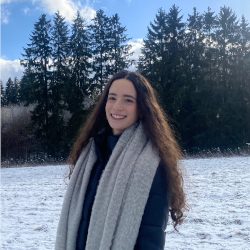

Studying BA Psychology - University of Nevada, Reno

 
<h2>Karina Kneeland</h2>
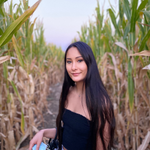

Studying BA Psychology - University of Nevada, Reno

 
<h2>Wesley Chen</h2>
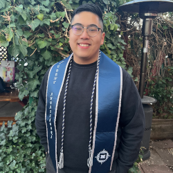

BS Neuroscience - University of Nevada, Reno (2022)

 
<h2>Kevin Soto</h2>
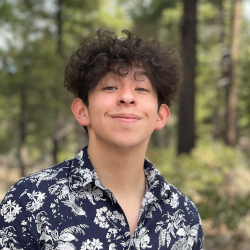
  

<h2>Anna Haugland</h2>
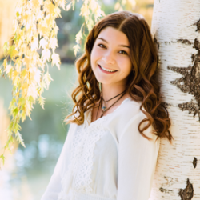

BA Psychology - University of Nevada, Reno (2022)

<b>Publications </b>

Sarah M Haigh, Anna M Haugland, Lourdes M Mendoza, & Mackenzie Montero (2023). Auditory discomfort in visually sensitive individuals. <i>Frontiers in Psychology: Perception Science. 14,</i> 1126481. <a href="https://doi.org/10.3389/fpsyg.2023.1126481">https://doi.org/10.3389/fpsyg.2023.1126481</a>.

<h2>Janea Santiago</h2>
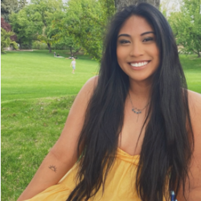

BS Neuroscience - University of Nevada, Reno (2022)

<b>Conference Presentations </b>

Sarah M Haigh, Melissa M Cortez, Lauren M Thompson, Anastasia Chevychalova, Janea Santiago & KC Brennan (Nov 2022). Sensory sensitivity across the migraine cycle. Poster presented at the Society of Neuroscience conference. San Diego, CA, USA.

<h2>Laura Van Key</h2>
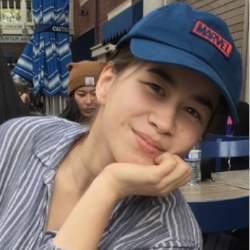

BS Molecular Microbiology & Immunology and Nursing - University of Nevada, Reno (2023)

<b>Publications</b>

Sarah M Haigh, Laura Van Key, Pat Brosseau, Shaun M Eack, David I Leitman, Dean F Salisbury & Marlene Behrmann (2023). Assessing Trial-to-Trial Variability in Auditory ERPs in Autism and Schizophrenia. S.I.: Developmental Approach and Targeted Treatment of Sensory Alterations. <i>Journal of Autism and Developmental Disorders. 53</i>(12), 4856-4871. <a href="https://doi.org/10.1007/s10803-022-05771-0">https://doi.org/10.1007/s10803-022-05771-0</a>.

<b>Conference Presentations </b>

Carson C Smith, Matthew Cummings, Laura I Van Key & Sarah M Haigh (May 2023). Localizing Visual Allodynia in Migraine. Poster presented at the Vision Sciences Society, St Petersburg, FL, USA. <i>Journal of Vision 23</i>(9), 5474. <a href="https://doi.org/10.1167/jov.23.9.5474">https://doi.org/10.1167/jov.23.9.5474</a>. 

<h2>Anastasiya Chevychalova</h2>
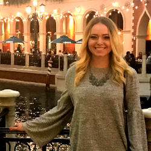

BS Neuroscience - University of Nevada, Reno (2022)

<b>Conference Presentations </b>

Sarah M Haigh, Melissa M Cortez, Lauren M Thompson, Anastasia Chevychalova, Janea Santiago & KC Brennan (Nov 2022). Sensory sensitivity across the migraine cycle. Poster presented at the Society of Neuroscience conference. San Diego, CA, USA.

<h2>Tabatha Walford</h2>
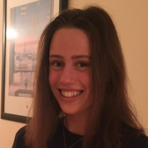

BA Psychology - Honors College, University of Nevada, Reno (2021)

Received a Nevada Undergraduate Research Award (2021)

<b>Publications</b>

Sarah M Haigh, Tabatha P Walford, & Patricia Brosseau (2021). Heart rate variability in schizophrenia and autism. <i>Frontiers in Psychiatry: Schizophrenia. 12,</i> 2129. <a href="https://doi.org/10.3389/fpsyt.2021.760396">https://doi.org/10.3389/fpsyt.2021.760396</a>.

<h2>Lourdes Mendoza</h2>
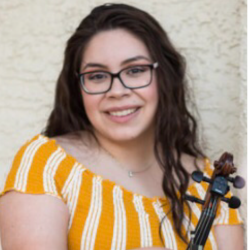

BS Psychology - University of Nevada, Reno (2021)

Currently a Masters student in Music Therapy at Texas Women's University

<b>Publications</b>

Sarah M Haigh, Anna M Haugland, Lourdes M Mendoza, & Mackenzie Montero (2023). Auditory discomfort in visually sensitive individuals. <i>Frontiers in Psychology: Perception Science. 14,</i> 1126481. <a href="https://doi.org/10.3389/fpsyg.2023.1126481">https://doi.org/10.3389/fpsyg.2023.1126481</a>.

<h2>Xortia Ross</h2>
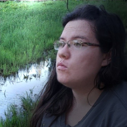

BS Behavioral Analysis - University of Nevada, Reno (2021)

<b>Publications</b>

Olivier Penacchio, Sarah M Haigh, Xortia Ross, Rebecca Ferguson, & Arnold J Wilkins (2021). Visual discomfort and variations in chromaticity in art and nature. <i>Frontiers in Neuroscience: Perception Science. 15,</i> 1706. <a href="https://doi.org/10.3389/fnins.2021.711064">https://doi.org/10.3389/fnins.2021.711064</a>
 
<b>Conference Presentations </b>

<ul>
<li>Sarah M Haigh & Xortia Ross (May 2022). Sensitivity to chromaticity separation – Is it helpful? Poster presented at the Vision Sciences Society conference. St Petersburg, FL, USA. <i>Journal of Vision 22</i>(14), 3778-3778. <a href="https://doi.org/10.1167/jov.22.14.3778">https://doi.org/10.1167/jov.22.14.3778</a>. </li>
<li>Olivier Penacchio, Sarah Haigh, Xortia Ross, Rebecca Ferguson & Arnold Wilkins (August, 2021). Visual discomfort and the chromatic content of natural scenes. Talk presented virtually at the European Conference on Visual Perception. <i>Perception, 50</i>(Suppl), 53.</li>
<li>Xortia Ross, Sarah M Haigh, Arnold J Wilkins & Olivier Penacchio (May 2021). Discomfort form Contemporary Art. Poster presented at the Virtual Vision Sciences Society (V-VSS) conference – undergraduate poster session. <i>Journal of Vision 21</i>(9), 2959-2959. <a href="https://doi.org/10.1167/jov.21.9.2959">https://doi.org/10.1167/jov.21.9.2959</a>.</li>
<li>Olivier Penacchio, Sarah Haigh, Xortia Ross, Rebecca Ferguson & Arnold Wilkins (December, 2020). Predicting visual discomfort from images. Talk presented virtually at the Applied Vision Association conference, London, UK. <i>Perception, 50</i>(6), 580-580. </li>
</ul>

<h2>Rebecca Ferguson</h2>
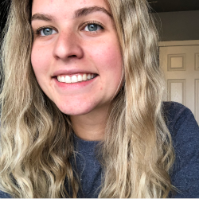

BS Behavioral Analysis - University of Nevada, Reno (2021)

<b>Publications</b>

Olivier Penacchio, Sarah M Haigh, Xortia Ross, Rebecca Ferguson, & Arnold J Wilkins (2021). Visual discomfort and variations in chromaticity in art and nature. <i>Frontiers in Neuroscience: Perception Science. 15,</i> 1706. <a href="https://doi.org/10.3389/fnins.2021.711064">https://doi.org/10.3389/fnins.2021.711064</a>.
 
<b>Conference Presentations </b>

<ul>
<li>Sarah M Haigh & Xortia Ross (May 2022). Sensitivity to chromaticity separation – Is it helpful? Poster presented at the Vision Sciences Society conference. St Petersburg, FL, USA. <i>Journal of Vision 22</i>(14), 3778-3778. <a href="https://doi.org/10.1167/jov.22.14.3778">https://doi.org/10.1167/jov.22.14.3778</a>. </li>
<li>Olivier Penacchio, Sarah Haigh, Xortia Ross, Rebecca Ferguson & Arnold Wilkins (August, 2021). Visual discomfort and the chromatic content of natural scenes. Talk presented virtually at the European Conference on Visual Perception. <i>Perception, 50</i>(Suppl), 53.</li>
<li>Olivier Penacchio, Sarah Haigh, Xortia Ross, Rebecca Ferguson & Arnold Wilkins (December, 2020). Predicting visual discomfort from images. Talk presented virtually at the Applied Vision Association conference, London, UK. <i>Perception, 50</i>(6), 580-580. </li>
</ul>

<h2>Rory Thompson</h2>

BA Psychology - Vassar College (2021)

<b>Publications</b>

Caitlin A Laycox, Rory Thompson, Jasmine A Haggerty, Arnold J Wilkins & Sarah M Haigh (2024). Flicker Slows Reading Speed: Effects on Individuals with Visually Sensitivity. <i>Perception. 53</i>(8), 512-528. <a href="https://doi.org/10.1177/03010066241252066">https://doi.org/10.1177/03010066241252066</a>.
<b>Conference Presentations </b>

Sarah M Haigh, Melissa M Cortez, Lauren M Thompson, Anastasia Chevychalova, Janea Santiago & KC Brennan (Nov 2022). Sensory sensitivity across the migraine cycle. Poster presented at the Society of Neuroscience conference. San Diego, CA, USA.

Sarah M Haigh, Caitlin A Laycox, Rory Thompson, Jasmine A Haggerty & Arnold J Wilkins (May 2023). Flicker Impairs Reading Speed: Impacts on the Visually Sensitive. Poster presented at the Vision Sciences Society, St Petersburg, FL, USA. <i>Journal of Vision 23</i>(9), 4782. <a href="https://doi.org/10.1167/jov.23.9.4782">https://doi.org/10.1167/jov.23.9.4782</a>.

<h2>Zoe Slaughter</h2>
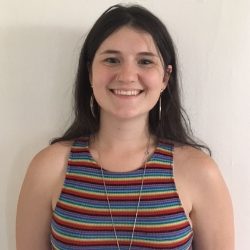

BA Psychology - Honors College, University of Nevada, Reno (2020)
 

<h2>Pat Brosseau</h2>

BS Psychology - Carnegie Mellon University (2020)

<b>Publications </b>

<ul>
<li>Sarah M Haigh, Laura Van Key, Pat Brosseau, Shaun M Eack, David I Leitman, Dean F Salisbury & Marlene Behrmann (2023). Assessing Trial-to-Trial Variability in Auditory ERPs in Autism and Schizophrenia. S.I.: Developmental Approach and Targeted Treatment of Sensory Alterations. <i>Journal of Autism and Developmental Disorders. 53</i>(12), 4856-4871. <a href="https://doi.org/10.1007/s10803-022-05771-0">https://doi.org/10.1007/s10803-022-05771-0</a>.</li> 
<li>Sarah M Haigh, Pat Brosseau, Shaun M Eack, David I Leitman, Dean F Salisbury, & Marlene Behrmann (2022). Hyper-sensitivity to pitch and poorer prosody processing in adults with autism: an ERP study. <i>Frontiers in Psychiatry: Autism. 13.</i> <a href="https://doi.org/10.3389/fpsyt.2022.844830 ">https://doi.org/10.3389/fpsyt.2022.844830</a>.</li>
<li>Sarah M Haigh, Laura Van Key, Pat Brosseau, Shaun M Eack, David I Leitman, Dean F Salisbury & Marlene Behrmann (2023). Assessing Trial-to-Trial Variability in Auditory ERPs in Autism and Schizophrenia. S.I.: Developmental Approach and Targeted Treatment of Sensory Alterations. <i>Journal of Autism and Developmental Disorders. 53</i>(12), 4856-4871. <a href="https://doi.org/10.1007/s10803-022-05771-0">https://doi.org/10.1007/s10803-022-05771-0</a>.</li></ul>
 
<b>Conference Presentations </b>

<ul>
<li>Sarah M Haigh, Patricia Brosseau, Shaun M Eack, Chinmaya Lele, David I Leitman, Dean F Salisbury, Marlene Behrmann (May 2020). Hyper- and hypo-sensitivity to pitch is related to poorer prosody processing: a study in autism and schizophrenia. Poster online at the Society of Biological Psychiatry conference. New York, NY, USA. <i>Biological Psychiatry 87</i>(9), S183. <a href="https://doi.org/10.1016/j.biopsych.2020.02.481">https://doi.org/10.1016/j.biopsych.2020.02.481</a>.</li>
<li>Sarah M Haigh, Patricia Brosseau, Shaun M Eack, Chinmaya Lele, David I Leitman, Dean F Salisbury & Marlene Behrmann (October 2019). Hyper-sensitivity to pitch is related to poorer prosody processing in adults with autism. Poster presented at the Society for Neuroscience. Chicago, IL, USA.</li></ul>
 
