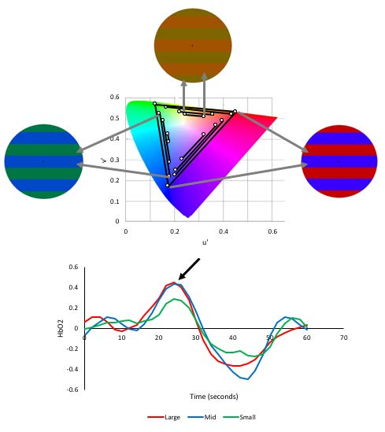
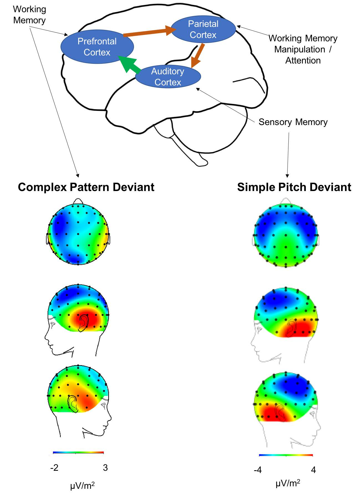
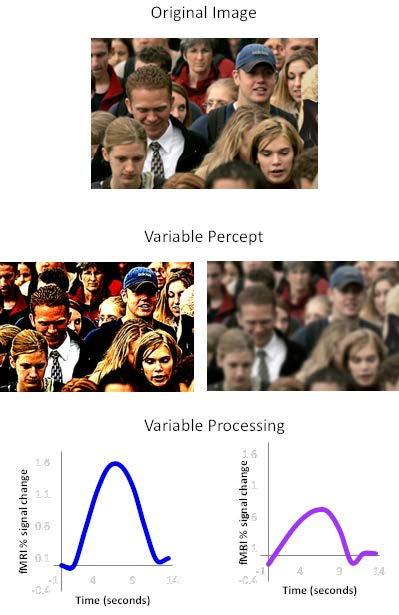
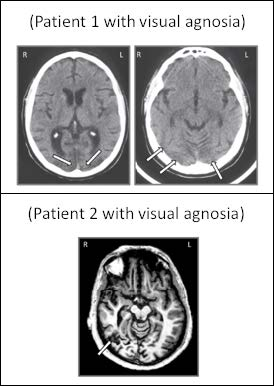

Overview of research
----
Our lab is driven by two fundamental questions (1) why are some people really sensitive to their environment, to the point of inducing discomfort and pain, whereas others are not? (2) What impact does this have on their ability to process incoming information? We approach sensory sensitivity as a spectrum, where some individuals are highly sensitive (are hyperresponsive) whereas others are under-sensitive (are hypo-responsive). The broad umbrellas of research interests listed below are not exhaustive and are not described in any particular order.

Sensory sensitivity: focus on migraine
====
This area of research takes a three-pronged approach: first is to identify stimuli that the majority of the general population find uncomfortable. The second is to examine the individual differences in discomfort to help further probe mechanisms underlying the discomfort. The third is to then investigate the (potentially negative) effects of the uncomfortable stimuli on the ability to function. 
Unnatural stimuli tend to be perceived as uncomfortable and are computationally inefficient to encode. We have identified components of visual and auditory stimuli that evoke discomfort and are probing the neural correlates. So far, we argue that these effects are cortical in nature and are not due to abnormal processing in the eye. They also persist regardless of semantics (see some of the images used below) and we are examining the potential costs of these sensitivities on our ability to process information.
 Sensory allodynia (sensitivity and discomfort to stimuli) is commonly reported in migraine during and between attacks, making migraine an ideal group to focus on for probing individual differences in sensitivity. Identifying what stimuli trigger allodynia and why they are uncomfortable is imperative for generating comfortable and sensorily efficient environments at home and in the workplace. Understanding the behavioral and neural responses to uncomfortable stimuli can also help identify the underlying psychopathology of migraine.Individuals with migraine, and those with general sensory sensitivity independent of migraine,tend to exhibit heightened neural and metabolic responses to stimuli. We are now examininghow the allodynia manifests along the sensory pathways to identify new potential targets fortreatment. 
We are now expanding this focus to identify if uncomfortable sensory environments negatively impact processing and cognition. Coming soon!

Sensitivity to color
=
The majority of the studies investigating how color is encoded in the brain have focused on the relative contribution of luminance and cone activation to explain cortical activity. We focused on chrominance/chromaticity separation to investigate cortical color processing. We measured the relationship between chromaticity separation (the degree of difference in color, for example, red and green having a greater chromaticity separation than yellow and orange) and the change in the hemodynamic response (measured using NIRS), in alpha suppression, and in ERPs (both measured using EEG) in the visual cortex. Regardless of the measurement used, there was a significant linear increase in cortical response with greater chromaticity separation. Individuals with migraine, who are known to experience heightened visual sensitivity, reported greater discomfort and larger ERPs compared to headache-free controls. Ocular accommodation was unaffected. The relationship between chromaticityseparation and behavioral and neural response was only linear when chromaticity separation was calculated in perceptual (CIE UCS) color space, and not with cone activation (MacLeod-Boynton). This demonstrated that color encoding as early as V1 may be related to perceptual diff erence in color independent of cone contrast. Together this suggests a homeostatic mechanism where the discomfort can serve to avoid stimuli that cause heightened excitation.

  

Auditory sensitivity in clinical populations
=
A number of psychiatric and neurological conditions have abnormal auditory sensitivities, including migraine, autism,and schizophrenia. Examining the specific parameters of the auditory stimuli that the general population are sensitive to will help identify the ways in which certain populations differ. This can reveal the contributions of the sensitivities on their underlying their symptoms. For example, in autism, we have found that when subtle differences in sensory thresholds are accounted for, then any differences in sensory attention disappear when compared to controls. Similarly, both individuals with chronic schizophrenia and individuals at their first-episode of schizophrenia are able to efficiently categorize auditory stimuli and show similar effects of adaptation to their matched controls. This is despite individuals with chronic and first-episode schizophrenia showing reduced neural sensitivity to changes in complex auditory patterns. Together, these findings suggest that strict controls over incoming sensory information can significantly impact, and maybe even improve, auditory-related cognition.
We have recently begun examining the specific parameters of auditory stimuli that make them uncomfortable to listen to. Establishing what the general population finds uncomfortable will help identify what is driving the heightened discomfort in sensitive populations. Overall, pitch and modulation frequencies drive discomfort, particularly in those who are visually sensitive.

  

Sensory sensitivity as a spectrum: an investigation in autism and schizophrenia
=
Several populations are characterized by sensory abnormalities including schizophrenia and autism. Schizophrenia and autism share many diagnostic features – originally autism was a part of the schizophrenia diagnosis in the DSM 2 – and there is considerable genetic overlap. Our aim is to understand what neural mechanisms are shared by autism and schizophrenia and what mechanisms are unique. Understanding the different mechanisms can lead to improved biomarkers that are diagnostically specific.
Both autism and schizophrenia exhibit slower information processing which could be due to abnormal white matter tracts impairing connectivity across the brain. We found abnormal diffusion brain-wide in autism and in schizophrenia, but that this was more impaired in schizophrenia.
As both autism and schizophrenia are associated with sensory abnormalities (DSM 5), we narrowed our focus here. One of the abnormal neural characteristics of sensory processing in autism is that they exhibit greater trial-to-trial variability in visual, auditory, and somatosensory modalities.The greater variability in autism also manifested in behavioral responses (specifically in the somatosensory modality) and was related to increased sensory sensitivity.
Individuals with schizophrenia tend to under-respond to sensory information, and this impacts processing throughout the sensory pathway. Therefore, we compare sensory processing in autism and schizophrenia directly, and examine how abnormal early sensory processing impacts more complex processing later in the sensory pathway.
We are finding that sensory processing in autism and in schizophrenia tends to be more variable over time compared to non-clinical individuals. This is despite sensory responses being often larger in autism (hyper-responsive) and smaller in schizophrenia (hypo-responsive) compared to non-clinical groups. Because of this, we are now approaching sensory processing as a spectrum where some individuals are more sensitive (similar to autism, and migraine - see above) whereas others are less sensitive (similar to schizophrenia).We are currently investigating these effects in the general population and how they relate to autism and schizotypy traits.
We will be exploring this in more depth by asking how (suboptimal?) early sensory processing directly relates to later cognition and symptomatology in autism compared to schizophrenia.So far, we are finding that hyper- and hypo-responses in early sensory processing, for example to auditory pitch, are related to hypo-responses later in the processing pathway, for example,when processing prosodic/emotional utterances. 
The next aim is to find methods to stabilize their early sensory responses and identify their impact on later processing.

  

Manipulating sensory input to investigate underlying physiology
=
Visual stimulation can be a useful method to investigating the neural mechanisms that are abnormal in clinicalconditions. Here are a couple of examples: 
(1) We have used grating patterns that differ in their motion profile to dissociate the neural mechanisms that underlie migraine from epilepsy: both conditions exhibit a hyper-excitable cortex, but epilepsy is more sensitive to stimuli thatevoke neural synchrony than migraine.
(2) We are currently investigating the impact of light box therapy on the visual system in bipolar disorder to identify whether light can act as a stimulation technique forimproving visual processing.
(3) We investigated the reverse of this relationship: if we know the parts of the visual system that are damaged, as with individuals with acquired agnosia, can we track the incoming visual signal through the visual system using EEG to ascertain where the damage is located without the needfor expensive diagnostic testing? We have successfully been able to do so in two patients who had agnosia due todamage to different parts of the visual system.
These methods are simple, inexpensive, and fast to implement. Therefore, improving these methods may helpidentify abnormal pathways in patients without the need for expensive tests.

  

