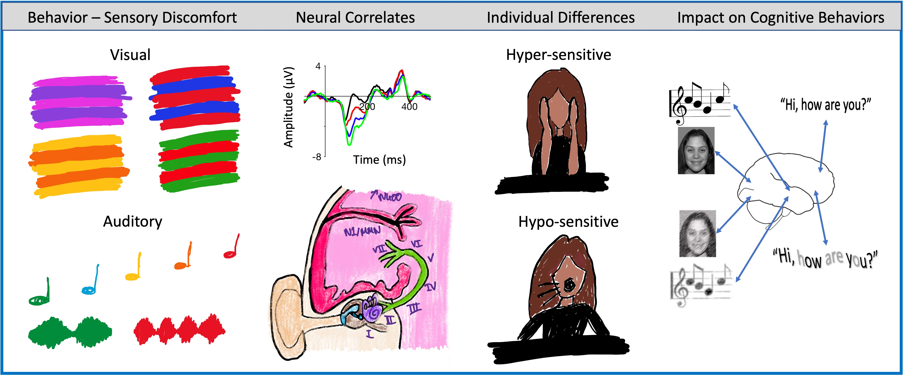
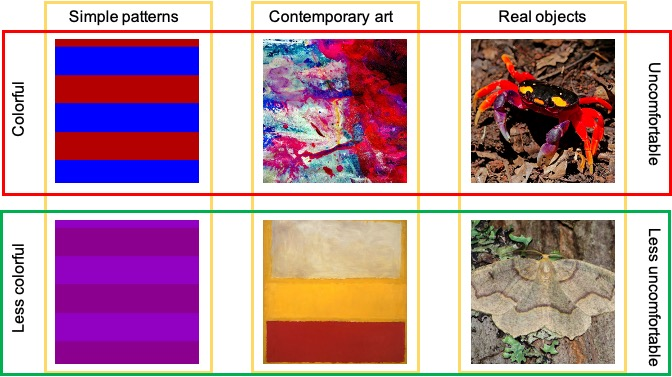
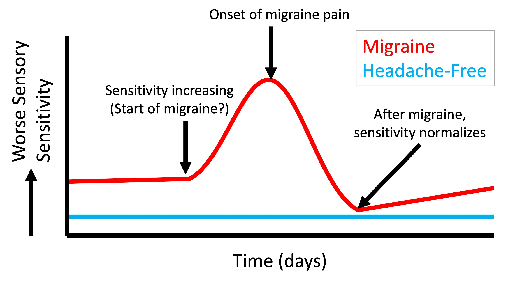
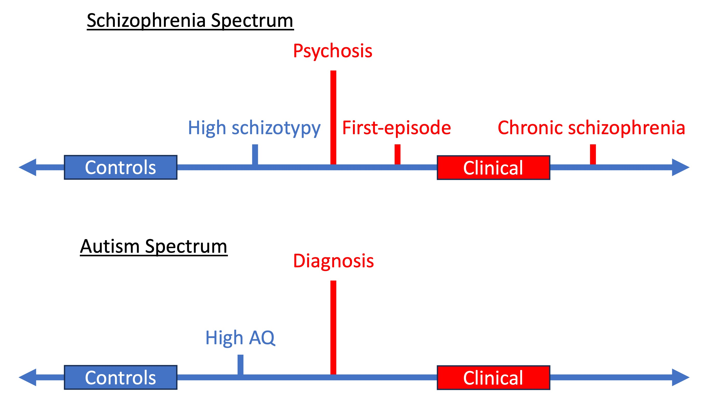

Overview of Research
----
Our lab is driven by two fundamental questions (1) why are some people really sensitive to their environment, to the point of inducing discomfort and pain, whereas others are not? (2) What impact does sensory discomfort have on their ability to process incoming information? 

We take a four-pronged approach: first we identify stimuli that the majority of the general population find uncomfortable. Second, we examine the neural correlates. Third, we assess the individual differences in sensitivity to further probe mechanisms underlying the discomfort. Fourth, we then investigate the (potentially negative) effects of the uncomfortable stimuli on the ability to function. 

We approach sensory sensitivity as a spectrum, where some individuals are highly sensitive (are hyperresponsive) whereas others are under-sensitive (are hypo-responsive). The list of research interests listed below is not exhaustive and are not described in any particular order.

  <figcaption class="figure-caption text-center"> Figure 1. Summary of approach to sensory sensitivity and its effects on behavior.</figcaption>

Sensory Discomfort
====
Unnatural stimuli tend to be perceived as uncomfortable and are computationally inefficient to encode. We have identified components of visual and auditory stimuli that evoke discomfort and are probing the neural correlates. So far, we argue that these effects are cortical in nature but are currently exploring processing uncomfortable stimuli in the eye and ear/brainstem. They also persist regardless of semantics (see Figure 2 for some of the images used) and we are examining the potential costs of these sensitivities on our ability to process information.

We are now expanding this focus to identify if uncomfortable sensory environments negatively impact processing and cognition. Some interesting results <a href="https://doi.org/10.1177/03010066241252066">already</a> so stay tuned!

  <figcaption class="figure-caption text-center"> Figure 2. Discomfort from an image can be tracked by measuring low level features such as color difference. And we can measure the effects on neural functioning and later processing. See the following papers for details: <a href="https://doi.org/10.1016/j.visres.2013.07.003">1</a>; <a href="https://doi.org/10.1016/j.visres.2021.01.007">2</a>; <a href="https://doi.org/10.3389/fnins.2021.711064">3</a>; <a href="https://doi.org/10.3389/fnins.2023.1200661">4</a>; <a href=" https://doi.org/10.1111/2041-210X.14268">5.</a></figcaption>

  
Individual Differences in Sensory Sensitivity
====

We focus on a number of neurological, psychiatric, and subclinical conditions to assess what behvaiorally separates the different groups, the underlying neruobiology, and what can be done to ameliorate the effects of sensory sensitivity on cognitive functioning.

We are currently assessing the relationship between a number of subclinical conditions that exhibit perturbed sensory processing and their effect on behavior, including <a href="https://doi.org/10.3389/fpsyg.2023.1126481">visual stress</a>, <a href="https://brill.com/view/journals/msr/aop/article-10.1163-22134808-bja10136/article-10.1163-22134808-bja10136.xml">ASMR</a>, misophonia, and hyperacusis.

Tracking Sensory Sensitivity in Migraine
=
Sensory allodynia (sensitivity and discomfort to stimuli) is commonly reported in migraine during an attack, but also between attacks. We are assessing the efficacy in tracking sensory sensitivity across the migraine cycle as a cause or an indicator of impending attack. Identifying what stimuli trigger allodynia and why they are uncomfortable is imperative for generating comfortable and sensorily efficient environments at home and in the workplace. Understanding the behavioral and neural responses to uncomfortable stimuli can also help identify the underlying psychopathology of migraine. 

  
  <figcaption class="figure-caption text-center"> Figure 3. Anticipated changes in sensory sensitivity of the migraine cycle compared to headache-free individuals.</figcaption>

Autism and Schizophrenia Spectrum Disorders
=
Schizophrenia and autism share many diagnostic features, including pertubations in sensory processing. Understanding the different mechanisms can lead to improved biomarkers that are diagnostically specific. Overall, we are finding that autistic adults tend to over-respond to simple sensory input whereas adults with schizophrenia under-respond. However, they both exhibit greater href="https://doi.org/10.1016/j.schres.2016.03.036">trial-to-trial variability</a> which appears to be related to their <a href="https://doi.org/10.1007/s10803-022-05771-0">sensory sensitivity</a>. Focusing on sensory processing may be a viable method for distinguishing between schizophrenia and autism.
  
Schizophrenia and autistic traits can also be detected in the general populations subclinically. This offers a way to understanding these conditions without medical confounds such as medication, and can reduce the burden on the clinical population. Similar to the diangosed populations, we are finding significant overlap in behavioral traits between subclinical high autim and schizophrenia (schizotypy) trait individuals, but that sensory processing can help distinguish between the <a href="https://doi.org/10.1080/13546805.2024.2335103">two</a>.

The next aim is to find methods to stabilize their early sensory responses and identify their effect on <a href="https://doi.org/10.1111/ejn.15961">later processing</a>.

  
  <figcaption class="figure-caption text-center"> Figure 4. Schizophrenia and autism spectra, from controls to subclinical to clinical conditions (courtesy of Wendy Torrens </figcaption>

